# Agent Specifications - Detailed Design

## Table of Contents
1. [Supervisor Agent](#supervisor-agent)
2. [Summarizer Agent](#summarizer-agent)
3. [Noise Agent (WF-5)](#noise-agent-wf-5)
4. [Impact Agent (WF-10)](#impact-agent-wf-10)
5. [Mitigation Agent (WF-25)](#mitigation-agent-wf-25)

---

## Supervisor Agent

### Overview
The Supervisor Agent is the central orchestrator responsible for coordinating all specialized agents, managing workflow state, and ensuring quality outcomes.

### Architecture

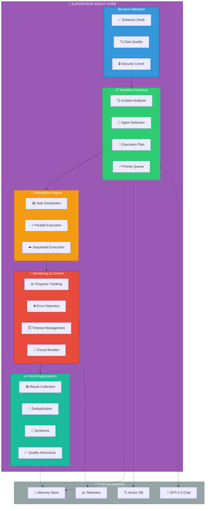

### State Machine

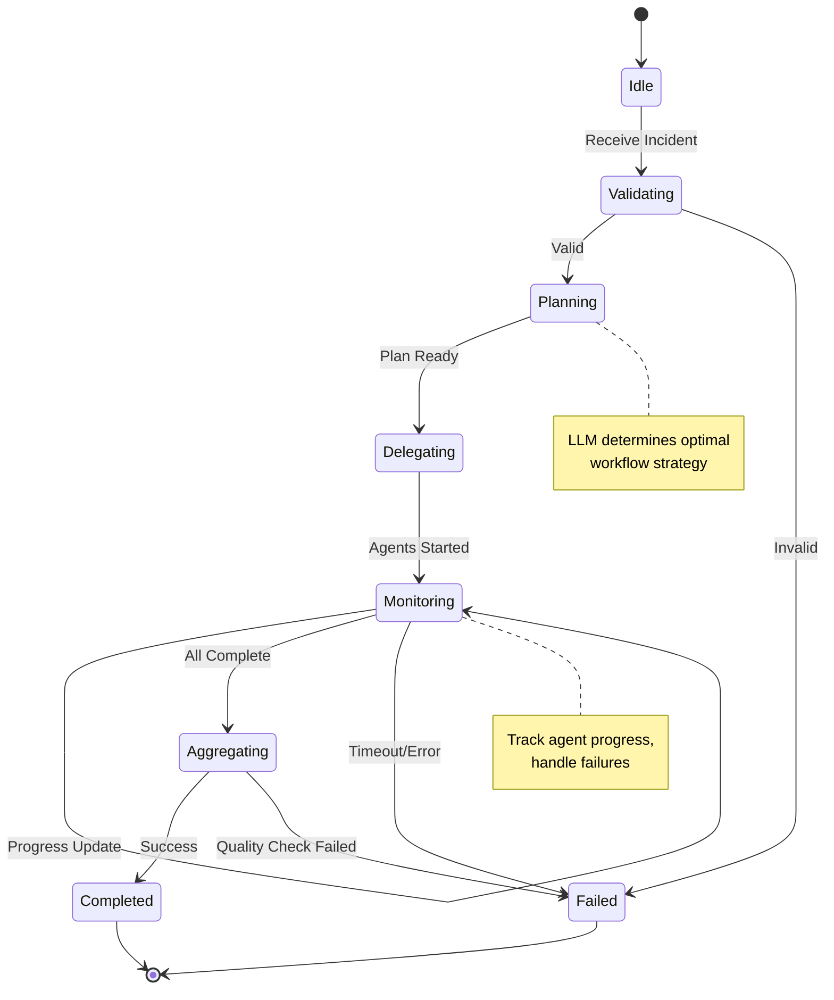

### Decision Logic

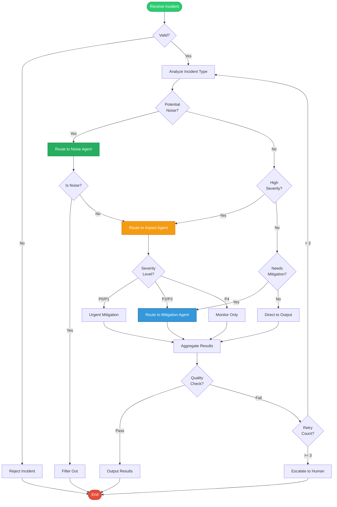

### Prompt Template

```python
SUPERVISOR_SYSTEM_PROMPT = """
You are the Supervisor Agent in an enterprise incident management system.

Your responsibilities:
1. Validate incoming incidents for completeness and quality
2. Analyze incident characteristics to determine optimal workflow
3. Delegate tasks to specialized agents (Noise, Impact, Mitigation)
4. Monitor agent execution and handle failures
5. Aggregate results and ensure quality

Decision criteria:
- Route to Noise Agent if: Recurring pattern, low severity, no user impact
- Route to Impact Agent if: High severity, multiple services affected, user impact
- Route to Mitigation Agent if: Requires action plan, automation available

Always provide clear reasoning for your decisions.
"""

SUPERVISOR_USER_PROMPT = """
Incident Details:
{incident_json}

Historical Context:
{similar_incidents}

Current System State:
{system_state}

Task: Analyze this incident and determine the optimal workflow strategy.
Provide your decision in JSON format with reasoning.
"""
```

### Key Methods

```python
class SupervisorAgent:
    async def process_incident(self, incident: Incident) -> SupervisorResult:
        """Main entry point for incident processing"""
        
    async def validate_incident(self, incident: Incident) -> ValidationResult:
        """Validate incident data quality and security"""
        
    async def plan_workflow(self, incident: Incident) -> WorkflowPlan:
        """Determine optimal agent workflow using LLM"""
        
    async def delegate_to_agents(self, plan: WorkflowPlan) -> List[AgentTask]:
        """Distribute tasks to specialized agents"""
        
    async def monitor_execution(self, tasks: List[AgentTask]) -> ExecutionStatus:
        """Track agent progress and handle failures"""
        
    async def aggregate_results(self, results: List[AgentResult]) -> AggregatedResult:
        """Combine and synthesize agent outputs"""
```

---

## Summarizer Agent

### Overview
The Summarizer Agent transforms raw, unstructured incident data into normalized, structured format suitable for downstream processing.

### Processing Pipeline

```mermaid
graph LR
    subgraph Input["📥 Input"]
        RawText["📄 Raw Text<br/>Unstructured"]
        Metadata["📋 Metadata<br/>Source, Timestamp"]
    end
    
    subgraph Extraction["🔍 Information Extraction"]
        direction TB
        TitleExtract["📌 Title Extraction"]
        DescExtract["📝 Description Extraction"]
        ServiceExtract["🔧 Service Identification"]
        ErrorExtract["❌ Error Pattern Extraction"]
        TimeExtract["⏰ Timestamp Extraction"]
    end
    
    subgraph Categorization["🏷️ Categorization"]
        direction TB
        TypeClassify["🎯 Type Classification<br/>Outage/Degradation/Security"]
        SeverityEstimate["⚡ Severity Estimation<br/>P0-P4"]
        ComponentMap["🗺️ Component Mapping<br/>Service Dependencies"]
    end
    
    subgraph Normalization["⚖️ Normalization"]
        direction TB
        SchemaMap["📐 Schema Mapping"]
        DataClean["🧹 Data Cleaning"]
        Validation["✅ Validation"]
    end
    
    subgraph Enrichment["✨ Enrichment"]
        direction TB
        HistoricalLookup["🔍 Historical Lookup<br/>Similar Incidents"]
        ContextAdd["🧠 Context Addition<br/>Service Health"]
        TagGeneration["🏷️ Tag Generation<br/>Auto-tagging"]
    end
    
    subgraph Output["📤 Output"]
        StructuredIncident["📊 Structured Incident<br/>JSON Schema"]
    end
    
    RawText --> TitleExtract
    Metadata --> TitleExtract
    
    TitleExtract --> DescExtract
    DescExtract --> ServiceExtract
    ServiceExtract --> ErrorExtract
    ErrorExtract --> TimeExtract
    
    TimeExtract --> TypeClassify
    TypeClassify --> SeverityEstimate
    SeverityEstimate --> ComponentMap
    
    ComponentMap --> SchemaMap
    SchemaMap --> DataClean
    DataClean --> Validation
    
    Validation --> HistoricalLookup
    HistoricalLookup --> ContextAdd
    ContextAdd --> TagGeneration
    
    TagGeneration --> StructuredIncident

    style Input fill:#E74C3C,stroke:#C0392B,stroke-width:2px,color:#fff
    style Extraction fill:#3498DB,stroke:#2874A6,stroke-width:2px,color:#fff
    style Categorization fill:#F39C12,stroke:#E67E22,stroke-width:2px,color:#fff
    style Normalization fill:#9B59B6,stroke:#8E44AD,stroke-width:2px,color:#fff
    style Enrichment fill:#1ABC9C,stroke:#16A085,stroke-width:2px,color:#fff
    style Output fill:#2ECC71,stroke:#27AE60,stroke-width:2px,color:#fff
```

### Categorization Logic

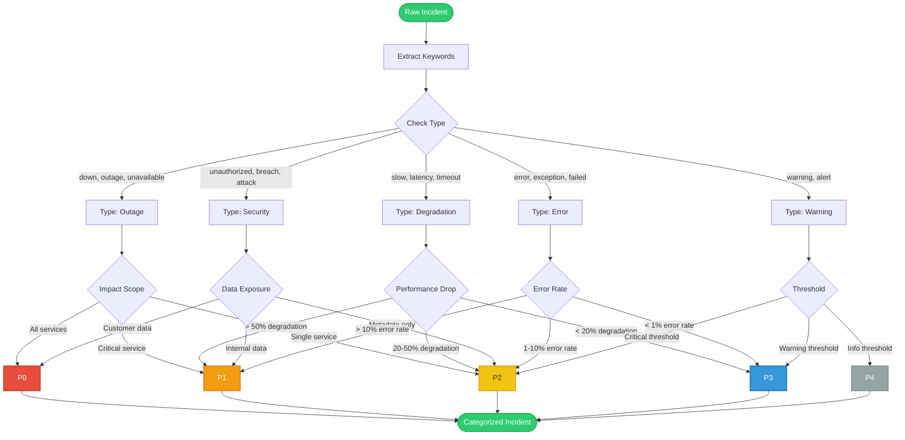

### Output Schema

```json
{
  "incident_id": "INC-2026-001234",
  "version": "1.0",
  "timestamp": "2026-02-10T10:00:00Z",
  "source": {
    "type": "email",
    "channel": "alerts@company.com",
    "original_id": "email-12345"
  },
  "classification": {
    "type": "outage",
    "category": "infrastructure",
    "subcategory": "database",
    "severity": "P1",
    "confidence": 0.92
  },
  "content": {
    "title": "Production Database Connection Timeout",
    "description": "Users unable to access application due to database connection failures",
    "affected_services": ["api-gateway", "user-service", "payment-service"],
    "error_patterns": ["ConnectionTimeout", "PoolExhausted"],
    "keywords": ["database", "timeout", "connection", "production"]
  },
  "metadata": {
    "environment": "production",
    "region": "us-west-2",
    "customer_impact": "high",
    "estimated_affected_users": 15000,
    "tags": ["database", "connectivity", "urgent"]
  },
  "enrichment": {
    "similar_incidents": ["INC-2026-001100", "INC-2025-098765"],
    "historical_resolution_time_avg": "45 minutes",
    "common_root_causes": ["connection pool exhaustion", "network issue"]
  }
}
```

---

## Noise Agent (WF-5)

### Overview
The Noise Agent filters false positives and non-actionable alerts from the incident stream.

### Detection Algorithm

```mermaid
graph TB
    subgraph Input["📥 Input"]
        Incident["🔴 Incident"]
    end
    
    subgraph FeatureExtraction["🔍 Feature Extraction"]
        direction TB
        PatternExtract["🔄 Pattern Extraction<br/>Recurring Signatures"]
        FrequencyAnalysis["📊 Frequency Analysis<br/>Time Series"]
        ServiceContext["🔧 Service Context<br/>Known Issues"]
        UserFeedback["👥 User Feedback<br/>Historical Labels"]
    end
    
    subgraph VectorSearch["🔍 Vector Search"]
        direction TB
        EmbedIncident["📊 Embed Incident<br/>text-embedding-3-large"]
        SearchSimilar["🔎 Search Similar<br/>Cosine Similarity"]
        RankResults["📈 Rank Results<br/>Top-K Matches"]
    end
    
    subgraph Classification["🏷️ Classification"]
        direction TB
        RuleBasedCheck["📋 Rule-based Check<br/>Known Noise Patterns"]
        LLMClassification["🤖 LLM Classification<br/>GPT-5.2 Analysis"]
        EnsembleVote["🗳️ Ensemble Vote<br/>Combine Signals"]
    end
    
    subgraph Scoring["📊 Noise Scoring"]
        direction TB
        HistoricalScore["📜 Historical Score<br/>40% weight"]
        SimilarityScore["🔄 Similarity Score<br/>30% weight"]
        FrequencyScore["⏰ Frequency Score<br/>20% weight"]
        FeedbackScore["👥 Feedback Score<br/>10% weight"]
        FinalScore["🎯 Final Noise Score<br/>0-100"]
    end
    
    subgraph Decision["✅ Decision"]
        direction TB
        Threshold{Score > 70?}
        Filter["🔇 Filter<br/>Mark as Noise"]
        Escalate["⚡ Escalate<br/>Pass to Impact Agent"]
    end
    
    subgraph Output["📤 Output"]
        Result["📋 Noise Result<br/>Decision + Reasoning"]
    end
    
    Incident --> PatternExtract
    PatternExtract --> FrequencyAnalysis
    FrequencyAnalysis --> ServiceContext
    ServiceContext --> UserFeedback
    
    UserFeedback --> EmbedIncident
    EmbedIncident --> SearchSimilar
    SearchSimilar --> RankResults
    
    RankResults --> RuleBasedCheck
    RankResults --> LLMClassification
    
    RuleBasedCheck --> EnsembleVote
    LLMClassification --> EnsembleVote
    
    EnsembleVote --> HistoricalScore
    HistoricalScore --> SimilarityScore
    SimilarityScore --> FrequencyScore
    FrequencyScore --> FeedbackScore
    FeedbackScore --> FinalScore
    
    FinalScore --> Threshold
    Threshold -->|Yes| Filter
    Threshold -->|No| Escalate
    
    Filter --> Result
    Escalate --> Result

    style Input fill:#E74C3C,stroke:#C0392B,stroke-width:2px,color:#fff
    style FeatureExtraction fill:#3498DB,stroke:#2874A6,stroke-width:2px,color:#fff
    style VectorSearch fill:#9B59B6,stroke:#8E44AD,stroke-width:2px,color:#fff
    style Classification fill:#F39C12,stroke:#E67E22,stroke-width:2px,color:#fff
    style Scoring fill:#1ABC9C,stroke:#16A085,stroke-width:2px,color:#fff
    style Decision fill:#E67E22,stroke:#D35400,stroke-width:2px,color:#fff
    style Output fill:#2ECC71,stroke:#27AE60,stroke-width:2px,color:#fff
```

### Noise Patterns

Common noise patterns automatically detected:

| Pattern Type | Example | Detection Method |
|-------------|---------|------------------|
| **Flapping Alerts** | Service up/down every 5 min | Frequency analysis |
| **Test Alerts** | "TEST" in title | Keyword matching |
| **Duplicate Alerts** | Same error, different timestamp | Deduplication |
| **Known Issues** | Documented non-issues | Knowledge base lookup |
| **Low Impact** | Single user, non-critical service | Impact scoring |
| **Auto-resolved** | Resolved within 1 minute | Time-to-resolution |

### Confidence Calibration

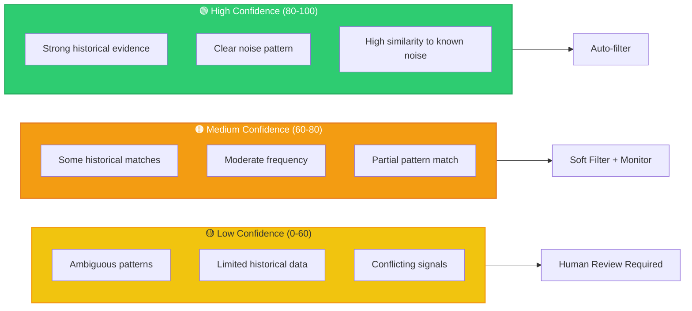

---

## Impact Agent (WF-10)

### Overview
The Impact Agent assesses incident severity and customer impact across multiple dimensions.

### Impact Assessment Framework

```mermaid
graph TB
    subgraph Input["📥 Input"]
        ValidatedIncident["🟢 Validated Incident"]
    end
    
    subgraph ScopeAnalysis["🌍 Scope Analysis"]
        direction TB
        ServiceMap["🗺️ Service Mapping<br/>Dependency Graph"]
        AffectedServices["🔧 Affected Services<br/>Direct + Indirect"]
        GeographicSpread["🌐 Geographic Spread<br/>Regional Impact"]
    end
    
    subgraph SeverityCalculation["⚡ Severity Calculation"]
        direction TB
        ErrorRate["📊 Error Rate<br/>% Failed Requests"]
        Latency["⏱️ Latency Impact<br/>P50, P95, P99"]
        Availability["💚 Availability<br/>Uptime %"]
        Throughput["📈 Throughput<br/>RPS Drop"]
    end
    
    subgraph UserImpact["👥 User Impact"]
        direction TB
        AffectedUsers["👤 Affected Users<br/>Count Estimation"]
        UserSegment["🎯 User Segment<br/>Free/Premium/Enterprise"]
        BusinessCriticality["💼 Business Criticality<br/>Revenue Impact"]
    end
    
    subgraph BusinessImpact["💰 Business Impact"]
        direction TB
        RevenueImpact["💵 Revenue Impact<br/>$/hour"]
        SLABreach["📋 SLA Breach<br/>Contract Risk"]
        ReputationRisk["⭐ Reputation Risk<br/>Brand Impact"]
    end
    
    subgraph TimeAnalysis["⏰ Time Analysis"]
        direction TB
        TimeToDetect["🔍 Time to Detect<br/>MTTD"]
        EstimatedTTR["🔧 Estimated TTR<br/>MTTR Prediction"]
        DurationImpact["⏳ Duration Impact<br/>Cumulative Effect"]
    end
    
    subgraph Aggregation["📊 Impact Aggregation"]
        direction TB
        WeightedScore["⚖️ Weighted Score<br/>Multi-dimensional"]
        PriorityLevel["🎯 Priority Level<br/>P0-P4"]
        ConfidenceInterval["📈 Confidence Interval<br/>95% CI"]
    end
    
    subgraph Output["📤 Output"]
        ImpactReport["📊 Impact Report<br/>Comprehensive Summary"]
    end
    
    ValidatedIncident --> ServiceMap
    ServiceMap --> AffectedServices
    AffectedServices --> GeographicSpread
    
    GeographicSpread --> ErrorRate
    ErrorRate --> Latency
    Latency --> Availability
    Availability --> Throughput
    
    Throughput --> AffectedUsers
    AffectedUsers --> UserSegment
    UserSegment --> BusinessCriticality
    
    BusinessCriticality --> RevenueImpact
    RevenueImpact --> SLABreach
    SLABreach --> ReputationRisk
    
    ReputationRisk --> TimeToDetect
    TimeToDetect --> EstimatedTTR
    EstimatedTTR --> DurationImpact
    
    DurationImpact --> WeightedScore
    WeightedScore --> PriorityLevel
    PriorityLevel --> ConfidenceInterval
    
    ConfidenceInterval --> ImpactReport

    style Input fill:#2ECC71,stroke:#27AE60,stroke-width:2px,color:#fff
    style ScopeAnalysis fill:#3498DB,stroke:#2874A6,stroke-width:2px,color:#fff
    style SeverityCalculation fill:#E74C3C,stroke:#C0392B,stroke-width:2px,color:#fff
    style UserImpact fill:#9B59B6,stroke:#8E44AD,stroke-width:2px,color:#fff
    style BusinessImpact fill:#F39C12,stroke:#E67E22,stroke-width:2px,color:#fff
    style TimeAnalysis fill:#1ABC9C,stroke:#16A085,stroke-width:2px,color:#fff
    style Aggregation fill:#E67E22,stroke:#D35400,stroke-width:2px,color:#fff
    style Output fill:#2ECC71,stroke:#27AE60,stroke-width:2px,color:#fff
```

### Severity Matrix

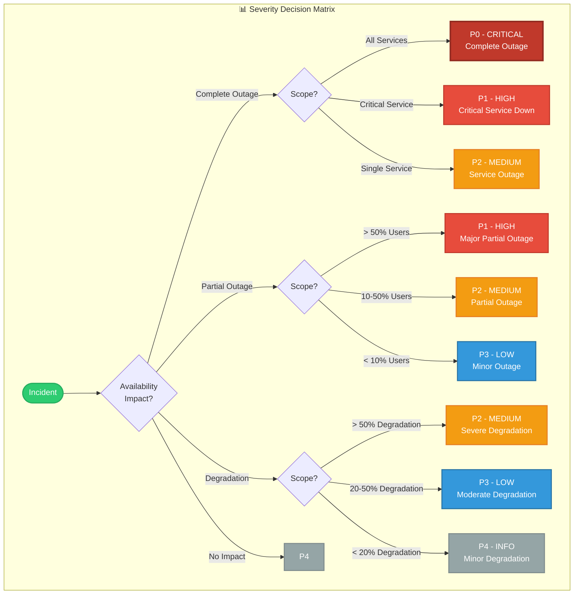

---

## Mitigation Agent (WF-25)

### Overview
The Mitigation Agent generates actionable remediation plans and orchestrates mitigation workflows.

### Mitigation Strategy

```mermaid
graph TB
    subgraph Input["📥 Input"]
        ImpactReport["📊 Impact Report"]
    end
    
    subgraph RootCauseAnalysis["🔍 Root Cause Analysis"]
        direction TB
        HypothesisGen["💡 Hypothesis Generation<br/>LLM-powered"]
        EvidenceGather["📊 Evidence Gathering<br/>Logs, Metrics"]
        CauseRanking["📈 Cause Ranking<br/>Probability Scoring"]
    end
    
    subgraph PlaybookRetrieval["📚 Playbook Retrieval"]
        direction TB
        SearchKB["🔎 Search Knowledge Base<br/>Vector Search"]
        MatchPlaybooks["📖 Match Playbooks<br/>Similar Incidents"]
        AdaptSolutions["🔄 Adapt Solutions<br/>Context-aware"]
    end
    
    subgraph PlanGeneration["📝 Plan Generation"]
        direction TB
        ImmediateActions["⚡ Immediate Actions<br/>0-15 min"]
        ShortTermActions["🔧 Short-term Actions<br/>15-60 min"]
        LongTermActions["📋 Long-term Actions<br/>1+ hours"]
    end
    
    subgraph ActionPrioritization["⚡ Action Prioritization"]
        direction TB
        ImpactScore["📊 Impact Score<br/>Expected Benefit"]
        EffortEstimate["⏱️ Effort Estimate<br/>Time Required"]
        RiskAssessment["⚠️ Risk Assessment<br/>Failure Probability"]
        Priority["🎯 Priority Ranking<br/>ROI-based"]
    end
    
    subgraph AutomationCheck["🤖 Automation Check"]
        direction TB
        RunbookAvailable{"Runbook<br/>Available?"}
        SafetyCheck["🔒 Safety Check<br/>Approval Required?"]
        AutoExecute["⚡ Auto-execute<br/>With Monitoring"]
        ManualStep["👤 Manual Step<br/>Human Required"]
    end
    
    subgraph Output["📤 Output"]
        MitigationPlan["📝 Mitigation Plan<br/>Action Plan"]
    end
    
    ImpactReport --> HypothesisGen
    HypothesisGen --> EvidenceGather
    EvidenceGather --> CauseRanking
    
    CauseRanking --> SearchKB
    SearchKB --> MatchPlaybooks
    MatchPlaybooks --> AdaptSolutions
    
    AdaptSolutions --> ImmediateActions
    ImmediateActions --> ShortTermActions
    ShortTermActions --> LongTermActions
    
    LongTermActions --> ImpactScore
    ImpactScore --> EffortEstimate
    EffortEstimate --> RiskAssessment
    RiskAssessment --> Priority
    
    Priority --> RunbookAvailable
    RunbookAvailable -->|Yes| SafetyCheck
    RunbookAvailable -->|No| ManualStep
    SafetyCheck -->|Safe| AutoExecute
    SafetyCheck -->|Risky| ManualStep
    
    AutoExecute --> MitigationPlan
    ManualStep --> MitigationPlan

    style Input fill:#2ECC71,stroke:#27AE60,stroke-width:2px,color:#fff
    style RootCauseAnalysis fill:#9B59B6,stroke:#8E44AD,stroke-width:2px,color:#fff
    style PlaybookRetrieval fill:#3498DB,stroke:#2874A6,stroke-width:2px,color:#fff
    style PlanGeneration fill:#F39C12,stroke:#E67E22,stroke-width:2px,color:#fff
    style ActionPrioritization fill:#1ABC9C,stroke:#16A085,stroke-width:2px,color:#fff
    style AutomationCheck fill:#E67E22,stroke:#D35400,stroke-width:2px,color:#fff
    style Output fill:#2ECC71,stroke:#27AE60,stroke-width:2px,color:#fff
```

### Action Timeline

```mermaid
gantt
    title Mitigation Action Timeline
    dateFormat  mm:ss
    axisFormat %M:%S
    
    section Immediate (0-15 min)
    Rollback Deployment           :crit, 00:00, 05:00
    Scale Up Resources            :crit, 00:00, 03:00
    Enable Circuit Breaker        :crit, 00:00, 02:00
    Alert On-call Team            :crit, 00:00, 01:00
    
    section Short-term (15-60 min)
    Apply Hotfix                  :active, 05:00, 20:00
    Reroute Traffic               :active, 03:00, 10:00
    Restart Services              :active, 05:00, 08:00
    Update Monitoring             :active, 10:00, 15:00
    
    section Long-term (1+ hours)
    Deploy Permanent Fix          :15:00, 30:00
    Update Documentation          :20:00, 20:00
    Post-mortem Analysis          :40:00, 40:00
    Implement Prevention          :60:00, 120:00
```

### Runbook Execution

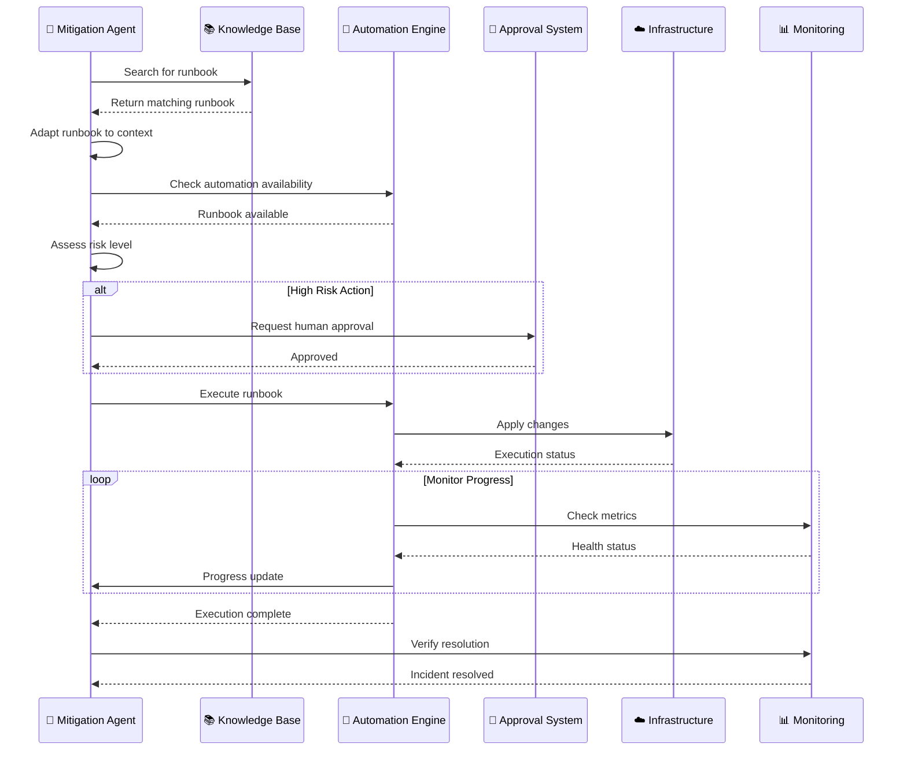

---

**Document Version**: 1.0  
**Last Updated**: February 10, 2026  
**Author**: ICM Flow Agents Team
