# ICM Flow Agents - GenAI Architecture Documentation

## Table of Contents
1. [System Overview](#system-overview)
2. [High-Level Architecture](#high-level-architecture)
3. [Layer-by-Layer Deep Dive](#layer-by-layer-deep-dive)
4. [Agent Workflows](#agent-workflows)
5. [Data Flow](#data-flow)
6. [Technology Stack](#technology-stack)

---

## System Overview

The ICM Flow Agents system is an enterprise-grade, multi-agent AI platform built on Microsoft Agent Framework (2025) and Azure AI Foundry, designed to automate incident management workflows using GPT-5.2.

### Key Capabilities
- **Intelligent Incident Processing**: Automated triage, categorization, and routing
- **Multi-Agent Orchestration**: Specialized agents for noise filtering, impact assessment, and mitigation
- **Enterprise Governance**: Built-in PII redaction, prompt injection detection, and content filtering
- **Scalable Architecture**: Leverages Azure AI Foundry's managed infrastructure
- **Observability**: Comprehensive monitoring, cost tracking, and health checks

---

## High-Level Architecture

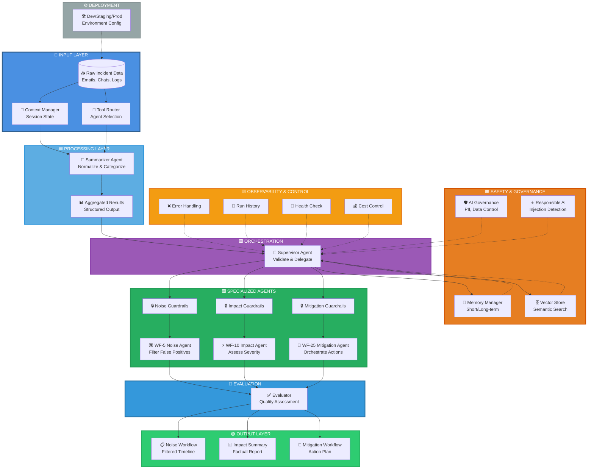
```mermaid
graph TB
    subgraph Input["🔵 INPUT LAYER"]
        RawData[("📥 Raw Incident Data<br/>Emails, Chats, Logs")]
        ContextMgr["🧠 Context Manager<br/>Session State"]
        ToolRouter["🔀 Tool Router<br/>Agent Selection"]
    end

    subgraph Deployment["⚙️ DEPLOYMENT"]
        DevEnv["🛠️ Dev/Staging/Prod<br/>Environment Config"]
    end

    subgraph Processing["🟦 PROCESSING LAYER"]
        Summarizer["📝 Summarizer Agent<br/>Normalize & Categorize"]
        Aggregator["📊 Aggregated Results<br/>Structured Output"]
    end

    subgraph Orchestration["🟪 ORCHESTRATION"]
        Supervisor["👔 Supervisor Agent<br/>Validate & Delegate"]
    end

    subgraph Safety["🟧 SAFETY & GOVERNANCE"]
        AIGov["🛡️ AI Governance<br/>PII, Data Control"]
        RespAI["⚠️ Responsible AI<br/>Injection Detection"]
        Memory["💾 Memory Manager<br/>Short/Long-term"]
        VectorStore["🗄️ Vector Store<br/>Semantic Search"]
    end

    subgraph Observability["🟨 OBSERVABILITY & CONTROL"]
        ErrorHandler["❌ Error Handling"]
        RunHistory["📜 Run History"]
        HealthCheck["💚 Health Check"]
        CostControl["💰 Cost Control"]
    end

    subgraph Agents["🟩 SPECIALIZED AGENTS"]
        NoiseGR["🔒 Noise Guardrails"]
        ImpactGR["🔒 Impact Guardrails"]
        MitigationGR["🔒 Mitigation Guardrails"]
        
        NoiseAgent["🔇 WF-5 Noise Agent<br/>Filter False Positives"]
        ImpactAgent["⚡ WF-10 Impact Agent<br/>Assess Severity"]
        MitigationAgent["🔧 WF-25 Mitigation Agent<br/>Orchestrate Actions"]
    end

    subgraph Evaluation["🔷 EVALUATION"]
        Evaluator["✅ Evaluator<br/>Quality Assessment"]
    end

    subgraph Output["🟢 OUTPUT LAYER"]
        NoiseOutput["📋 Noise Workflow<br/>Filtered Timeline"]
        ImpactOutput["📊 Impact Summary<br/>Factual Report"]
        MitigationOutput["📝 Mitigation Workflow<br/>Action Plan"]
    end

    RawData --> ContextMgr
    RawData --> ToolRouter
    DevEnv -.-> RawData
    
    ContextMgr --> Summarizer
    ToolRouter --> Summarizer
    
    Summarizer --> Aggregator
    Aggregator --> Supervisor
    
    Supervisor --> Memory
    Supervisor --> VectorStore
    Supervisor --> NoiseGR
    Supervisor --> ImpactGR
    Supervisor --> MitigationGR
    
    AIGov -.-> Supervisor
    RespAI -.-> Supervisor
    
    ErrorHandler -.-> Supervisor
    RunHistory -.-> Supervisor
    HealthCheck -.-> Supervisor
    CostControl -.-> Supervisor
    
    NoiseGR --> NoiseAgent
    ImpactGR --> ImpactAgent
    MitigationGR --> MitigationAgent
    
    NoiseAgent --> Evaluator
    ImpactAgent --> Evaluator
    MitigationAgent --> Evaluator
    
    Evaluator --> NoiseOutput
    Evaluator --> ImpactOutput
    Evaluator --> MitigationOutput
    
    Memory -.-> Supervisor
    VectorStore -.-> Supervisor

    style Input fill:#4A90E2,stroke:#2E5C8A,stroke-width:3px,color:#fff
    style Deployment fill:#95A5A6,stroke:#7F8C8D,stroke-width:2px,color:#fff
    style Processing fill:#5DADE2,stroke:#3498DB,stroke-width:3px,color:#fff
    style Orchestration fill:#9B59B6,stroke:#8E44AD,stroke-width:3px,color:#fff
    style Safety fill:#E67E22,stroke:#D35400,stroke-width:3px,color:#fff
    style Observability fill:#F39C12,stroke:#E67E22,stroke-width:3px,color:#fff
    style Agents fill:#27AE60,stroke:#229954,stroke-width:3px,color:#fff
    style Evaluation fill:#3498DB,stroke:#2874A6,stroke-width:3px,color:#fff
    style Output fill:#2ECC71,stroke:#27AE60,stroke-width:3px,color:#fff
```

---

## Layer-by-Layer Deep Dive

### 1. Input Layer 🔵

The Input Layer is the entry point for all incident data, responsible for ingestion, context management, and intelligent routing.

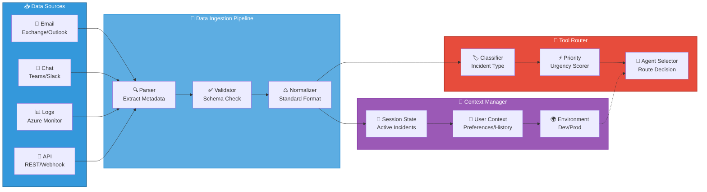
```mermaid
graph LR
    subgraph Sources["📥 Data Sources"]
        Email["📧 Email<br/>Exchange/Outlook"]
        Chat["💬 Chat<br/>Teams/Slack"]
        Logs["📊 Logs<br/>Azure Monitor"]
        API["🔌 API<br/>REST/Webhook"]
    end

    subgraph Ingestion["🔄 Data Ingestion Pipeline"]
        Parser["🔍 Parser<br/>Extract Metadata"]
        Validator["✅ Validator<br/>Schema Check"]
        Normalizer["⚖️ Normalizer<br/>Standard Format"]
    end

    subgraph Context["🧠 Context Manager"]
        SessionState["💾 Session State<br/>Active Incidents"]
        UserContext["👤 User Context<br/>Preferences/History"]
        EnvContext["🌍 Environment<br/>Dev/Prod"]
    end

    subgraph Router["🔀 Tool Router"]
        Classifier["🏷️ Classifier<br/>Incident Type"]
        Priority["⚡ Priority<br/>Urgency Scorer"]
        AgentSelector["🎯 Agent Selector<br/>Route Decision"]
    end

    Email --> Parser
    Chat --> Parser
    Logs --> Parser
    API --> Parser
    
    Parser --> Validator
    Validator --> Normalizer
    
    Normalizer --> SessionState
    Normalizer --> Classifier
    
    SessionState --> UserContext
    UserContext --> EnvContext
    
    Classifier --> Priority
    Priority --> AgentSelector
    
    EnvContext -.-> AgentSelector

    style Sources fill:#3498DB,stroke:#2874A6,stroke-width:2px,color:#fff
    style Ingestion fill:#5DADE2,stroke:#3498DB,stroke-width:2px,color:#fff
    style Context fill:#9B59B6,stroke:#8E44AD,stroke-width:2px,color:#fff
    style Router fill:#E74C3C,stroke:#C0392B,stroke-width:2px,color:#fff
```

#### Components

**📥 Raw Incident Data**
- **Purpose**: Multi-channel incident ingestion
- **Sources**: Email (Exchange/Outlook), Chat (Teams/Slack), Logs (Azure Monitor), REST APIs
- **Format**: Unstructured text, JSON, XML
- **Volume**: 10K-100K incidents/day

**🧠 Context Manager**
- **Purpose**: Maintain session state and context across agent interactions
- **Storage**: Azure Cosmos DB (NoSQL)
- **Features**:
  - Session persistence (30-day retention)
  - User preference management
  - Environment-aware routing (dev/staging/prod)
  - Conversation history tracking
- **Technology**: Python async context managers, Azure Cosmos DB SDK

**🔀 Tool Router**
- **Purpose**: Intelligent routing to appropriate agents based on incident characteristics
- **Algorithm**: GPT-5.2-powered classification + rule-based routing
- **Routing Logic**:
  ```python
  if incident.type == "noise_candidate":
      route_to(NoiseAgent)
  elif incident.severity >= HIGH:
      route_to(ImpactAgent, priority=True)
  elif incident.requires_mitigation:
      route_to(MitigationAgent)
  ```
- **Metrics**: Routing accuracy, latency, throughput

---

### 2. Processing Layer 🟦

The Processing Layer normalizes, categorizes, and structures incident data for downstream agents.

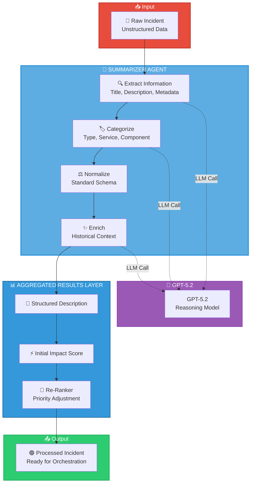
```mermaid
graph TB
    subgraph Input["📥 Input"]
        RawIncident["🔴 Raw Incident<br/>Unstructured Data"]
    end

    subgraph Summarizer["📝 SUMMARIZER AGENT"]
        direction TB
        ExtractInfo["🔍 Extract Information<br/>Title, Description, Metadata"]
        Categorize["🏷️ Categorize<br/>Type, Service, Component"]
        Normalize["⚖️ Normalize<br/>Standard Schema"]
        Enrich["✨ Enrich<br/>Historical Context"]
    end

    subgraph LLM1["🤖 GPT-5.2"]
        Model1["GPT-5.2<br/>Reasoning Model"]
    end

    subgraph Aggregator["📊 AGGREGATED RESULTS LAYER"]
        StructuredDesc["📄 Structured Description"]
        ImpactScore["⚡ Initial Impact Score"]
        ReRanker["🔄 Re-Ranker<br/>Priority Adjustment"]
    end

    subgraph Output["📤 Output"]
        ProcessedIncident["🟢 Processed Incident<br/>Ready for Orchestration"]
    end

    RawIncident --> ExtractInfo
    ExtractInfo --> Categorize
    Categorize --> Normalize
    Normalize --> Enrich
    
    ExtractInfo -.->|LLM Call| Model1
    Categorize -.->|LLM Call| Model1
    Enrich -.->|LLM Call| Model1
    
    Enrich --> StructuredDesc
    StructuredDesc --> ImpactScore
    ImpactScore --> ReRanker
    ReRanker --> ProcessedIncident

    style Input fill:#E74C3C,stroke:#C0392B,stroke-width:2px,color:#fff
    style Summarizer fill:#5DADE2,stroke:#3498DB,stroke-width:3px,color:#fff
    style LLM1 fill:#9B59B6,stroke:#8E44AD,stroke-width:2px,color:#fff
    style Aggregator fill:#3498DB,stroke:#2874A6,stroke-width:2px,color:#fff
    style Output fill:#2ECC71,stroke:#27AE60,stroke-width:2px,color:#fff
```

#### Components

**📝 Summarizer Agent**
- **Purpose**: Transform raw incident data into structured, actionable format
- **LLM**: GPT-5.2 (reasoning model)
- **Capabilities**:
  - **Information Extraction**: Title, description, affected services, timestamps
  - **Categorization**: Incident type (outage, degradation, security, etc.)
  - **Normalization**: Convert to standard schema (OpenTelemetry-compatible)
  - **Enrichment**: Add historical context from vector store
- **Prompt Engineering**:
  ```
  System: You are an expert incident analyst. Extract key information and categorize.
  User: [Raw incident data]
  Assistant: [Structured JSON output]
  ```
- **Output Schema**:
  ```json
  {
    "incident_id": "INC-2026-001234",
    "title": "Database Connection Timeout",
    "category": "infrastructure",
    "severity": "high",
    "affected_services": ["api-gateway", "user-service"],
    "timestamp": "2026-02-10T10:00:00Z",
    "description": "Normalized description...",
    "metadata": {...}
  }
  ```

**📊 Aggregated Results Layer**
- **Purpose**: Structure and prioritize processed incidents
- **Components**:
  - **Structured Description**: Clean, consistent format
  - **Impact Score**: Initial severity assessment (0-100)
  - **Re-Ranker**: Adjust priority based on business rules and historical data
- **Re-Ranking Algorithm**:
  - Historical incident similarity (vector search)
  - Service criticality weights
  - Time-of-day factors
  - Customer impact multipliers

---

### 3. Orchestration Layer 🟪

The Supervisor Agent is the central orchestrator, managing agent workflows and ensuring quality.

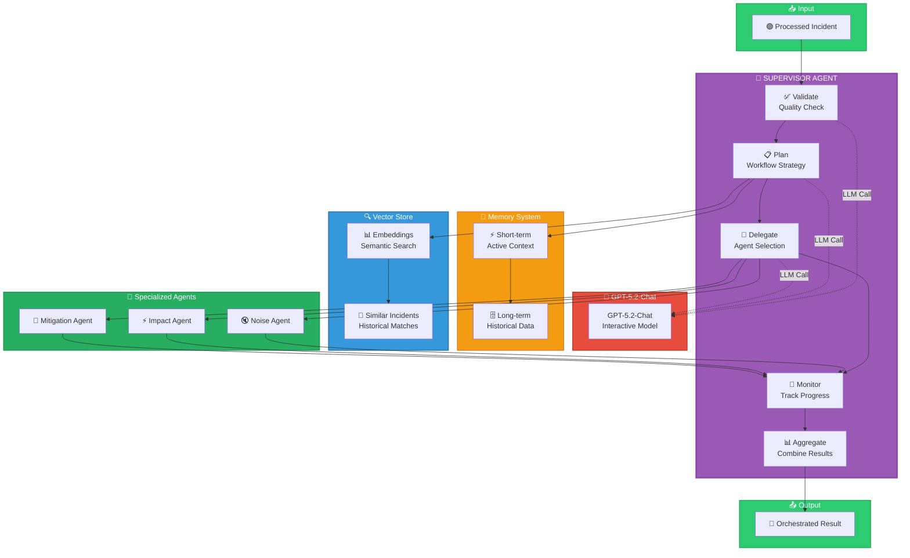
```mermaid
graph TB
    subgraph Input["📥 Input"]
        ProcessedIncident["🟢 Processed Incident"]
    end

    subgraph Supervisor["👔 SUPERVISOR AGENT"]
        direction TB
        Validate["✅ Validate<br/>Quality Check"]
        Plan["📋 Plan<br/>Workflow Strategy"]
        Delegate["🎯 Delegate<br/>Agent Selection"]
        Monitor["👀 Monitor<br/>Track Progress"]
        Aggregate["📊 Aggregate<br/>Combine Results"]
    end

    subgraph LLM2["🤖 GPT-5.2-Chat"]
        Model2["GPT-5.2-Chat<br/>Interactive Model"]
    end

    subgraph Memory["💾 Memory System"]
        ShortTerm["⚡ Short-term<br/>Active Context"]
        LongTerm["🗄️ Long-term<br/>Historical Data"]
    end

    subgraph VectorDB["🔍 Vector Store"]
        Embeddings["📊 Embeddings<br/>Semantic Search"]
        SimilarIncidents["🔄 Similar Incidents<br/>Historical Matches"]
    end

    subgraph Agents["🤖 Specialized Agents"]
        NoiseAgent["🔇 Noise Agent"]
        ImpactAgent["⚡ Impact Agent"]
        MitigationAgent["🔧 Mitigation Agent"]
    end

    subgraph Output["📤 Output"]
        OrchestratedResult["🎯 Orchestrated Result"]
    end

    ProcessedIncident --> Validate
    Validate --> Plan
    Plan --> Delegate
    Delegate --> Monitor
    Monitor --> Aggregate
    
    Validate -.->|LLM Call| Model2
    Plan -.->|LLM Call| Model2
    Delegate -.->|LLM Call| Model2
    
    Plan --> ShortTerm
    ShortTerm --> LongTerm
    
    Plan --> Embeddings
    Embeddings --> SimilarIncidents
    
    Delegate --> NoiseAgent
    Delegate --> ImpactAgent
    Delegate --> MitigationAgent
    
    NoiseAgent --> Monitor
    ImpactAgent --> Monitor
    MitigationAgent --> Monitor
    
    Aggregate --> OrchestratedResult

    style Input fill:#2ECC71,stroke:#27AE60,stroke-width:2px,color:#fff
    style Supervisor fill:#9B59B6,stroke:#8E44AD,stroke-width:3px,color:#fff
    style LLM2 fill:#E74C3C,stroke:#C0392B,stroke-width:2px,color:#fff
    style Memory fill:#F39C12,stroke:#E67E22,stroke-width:2px,color:#fff
    style VectorDB fill:#3498DB,stroke:#2874A6,stroke-width:2px,color:#fff
    style Agents fill:#27AE60,stroke:#229954,stroke-width:2px,color:#fff
    style Output fill:#2ECC71,stroke:#27AE60,stroke-width:2px,color:#fff
```

#### Components

**👔 Supervisor Agent**
- **Purpose**: Central orchestrator for multi-agent workflows
- **LLM**: GPT-5.2-Chat (interactive, conversational model)
- **Responsibilities**:
  1. **Validation**: Ensure incident data quality and completeness
  2. **Planning**: Determine optimal workflow strategy
  3. **Delegation**: Route to appropriate specialized agents
  4. **Monitoring**: Track agent progress and handle failures
  5. **Aggregation**: Combine results from multiple agents
- **Decision Logic**:
  ```python
  async def orchestrate(incident):
      # Validate
      if not is_valid(incident):
          return error_response()
      
      # Plan workflow
      workflow = await plan_workflow(incident)
      
      # Delegate to agents
      tasks = []
      if workflow.needs_noise_filtering:
          tasks.append(noise_agent.execute(incident))
      if workflow.needs_impact_assessment:
          tasks.append(impact_agent.execute(incident))
      if workflow.needs_mitigation:
          tasks.append(mitigation_agent.execute(incident))
      
      # Execute in parallel
      results = await asyncio.gather(*tasks)
      
      # Aggregate
      return aggregate_results(results)
  ```
- **Error Handling**: Retry logic, fallback strategies, circuit breakers

**💾 Memory Manager**
- **Purpose**: Maintain context across agent interactions
- **Architecture**:
  - **Short-term Memory**: Redis cache (15-min TTL) for active sessions
  - **Long-term Memory**: Azure Cosmos DB for historical data (30-day retention)
- **Data Stored**:
  - Conversation history
  - Agent decisions and rationale
  - User feedback
  - Performance metrics
- **Memory Retrieval**: Semantic search + recency weighting

**🗄️ Vector Store**
- **Purpose**: Semantic search for similar incidents and context retrieval
- **Technology**: Azure AI Search with vector indexing
- **Embeddings**: text-embedding-3-large (3072 dimensions)
- **Index Schema**:
  ```json
  {
    "incident_id": "string",
    "embedding": "vector(3072)",
    "title": "string",
    "description": "string",
    "resolution": "string",
    "metadata": "object"
  }
  ```
- **Search Queries**:
  - Similarity search (cosine distance)
  - Hybrid search (vector + keyword)
  - Filtered search (by service, severity, date range)

---

### 4. Safety & Governance Layer 🟧

Enterprise-grade safety and compliance controls.

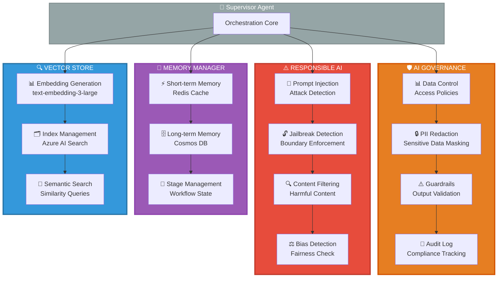
```mermaid
graph TB
    subgraph AIGov["🛡️ AI GOVERNANCE"]
        direction TB
        DataControl["📊 Data Control<br/>Access Policies"]
        PIIRedaction["🔒 PII Redaction<br/>Sensitive Data Masking"]
        Guardrails["⚠️ Guardrails<br/>Output Validation"]
        AuditLog["📜 Audit Log<br/>Compliance Tracking"]
    end

    subgraph RespAI["⚠️ RESPONSIBLE AI"]
        direction TB
        PromptInjection["🚫 Prompt Injection<br/>Attack Detection"]
        Jailbreak["🔓 Jailbreak Detection<br/>Boundary Enforcement"]
        ContentFilter["🔍 Content Filtering<br/>Harmful Content"]
        BiasDetection["⚖️ Bias Detection<br/>Fairness Check"]
    end

    subgraph Memory["💾 MEMORY MANAGER"]
        direction TB
        ShortTermMem["⚡ Short-term Memory<br/>Redis Cache"]
        LongTermMem["🗄️ Long-term Memory<br/>Cosmos DB"]
        StageManagement["🔄 Stage Management<br/>Workflow State"]
    end

    subgraph VectorStore["🔍 VECTOR STORE"]
        direction TB
        EmbeddingGen["📊 Embedding Generation<br/>text-embedding-3-large"]
        IndexManagement["🗂️ Index Management<br/>Azure AI Search"]
        SemanticSearch["🔎 Semantic Search<br/>Similarity Queries"]
    end

    subgraph Supervisor["👔 Supervisor Agent"]
        SupervisorCore["Orchestration Core"]
    end

    SupervisorCore --> DataControl
    SupervisorCore --> PromptInjection
    SupervisorCore --> ShortTermMem
    SupervisorCore --> EmbeddingGen
    
    DataControl --> PIIRedaction
    PIIRedaction --> Guardrails
    Guardrails --> AuditLog
    
    PromptInjection --> Jailbreak
    Jailbreak --> ContentFilter
    ContentFilter --> BiasDetection
    
    ShortTermMem --> LongTermMem
    LongTermMem --> StageManagement
    
    EmbeddingGen --> IndexManagement
    IndexManagement --> SemanticSearch

    style AIGov fill:#E67E22,stroke:#D35400,stroke-width:3px,color:#fff
    style RespAI fill:#E74C3C,stroke:#C0392B,stroke-width:3px,color:#fff
    style Memory fill:#9B59B6,stroke:#8E44AD,stroke-width:3px,color:#fff
    style VectorStore fill:#3498DB,stroke:#2874A6,stroke-width:3px,color:#fff
    style Supervisor fill:#95A5A6,stroke:#7F8C8D,stroke-width:2px,color:#fff
```

#### Components

**🛡️ AI Governance**

##### PII Redaction System

The PII Redaction system ensures sensitive personal information is protected across all agent interactions.

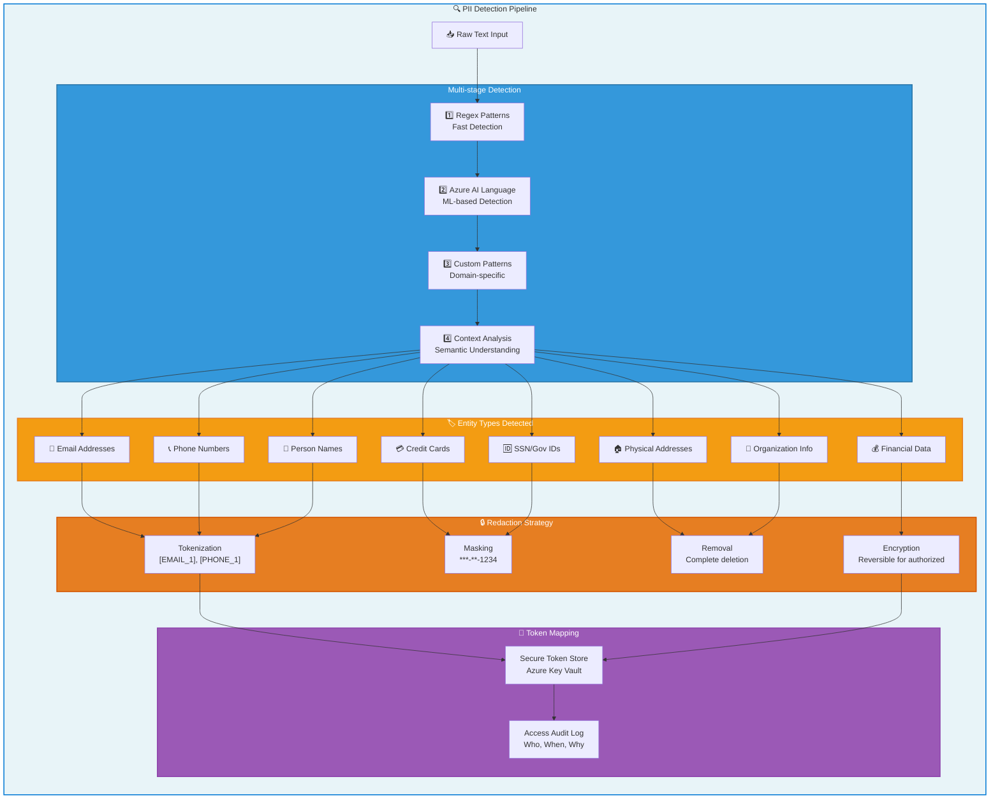
```mermaid
graph TB
    subgraph PIIDetection["🔍 PII Detection Pipeline"]
        direction TB
        Input["📥 Raw Text Input"]
        
        subgraph MultiStage["Multi-stage Detection"]
            Stage1["1️⃣ Regex Patterns<br/>Fast Detection"]
            Stage2["2️⃣ Azure AI Language<br/>ML-based Detection"]
            Stage3["3️⃣ Custom Patterns<br/>Domain-specific"]
            Stage4["4️⃣ Context Analysis<br/>Semantic Understanding"]
        end
        
        subgraph EntityTypes["🏷️ Entity Types Detected"]
            E1["📧 Email Addresses"]
            E2["📞 Phone Numbers"]
            E3["💳 Credit Cards"]
            E4["🆔 SSN/Gov IDs"]
            E5["🏠 Physical Addresses"]
            E6["👤 Person Names"]
            E7["🏢 Organization Info"]
            E8["💰 Financial Data"]
        end
        
        subgraph Redaction["🔒 Redaction Strategy"]
            R1["Tokenization<br/>[EMAIL_1], [PHONE_1]"]
            R2["Masking<br/>***-**-1234"]
            R3["Removal<br/>Complete deletion"]
            R4["Encryption<br/>Reversible for authorized"]
        end
        
        subgraph Storage["💾 Token Mapping"]
            TokenStore["Secure Token Store<br/>Azure Key Vault"]
            AccessLog["Access Audit Log<br/>Who, When, Why"]
        end
        
        Input --> Stage1
        Stage1 --> Stage2
        Stage2 --> Stage3
        Stage3 --> Stage4
        
        Stage4 --> E1
        Stage4 --> E2
        Stage4 --> E3
        Stage4 --> E4
        Stage4 --> E5
        Stage4 --> E6
        Stage4 --> E7
        Stage4 --> E8
        
        E1 --> R1
        E2 --> R1
        E3 --> R2
        E4 --> R2
        E5 --> R3
        E6 --> R1
        E7 --> R3
        E8 --> R4
        
        R1 --> TokenStore
        R4 --> TokenStore
        TokenStore --> AccessLog
    end

    style PIIDetection fill:#E8F4F8,stroke:#0078D4,stroke-width:2px,color:#333
    style MultiStage fill:#3498DB,stroke:#2874A6,stroke-width:2px,color:#fff
    style EntityTypes fill:#F39C12,stroke:#E67E22,stroke-width:2px,color:#fff
    style Redaction fill:#E67E22,stroke:#D35400,stroke-width:2px,color:#fff
    style Storage fill:#9B59B6,stroke:#8E44AD,stroke-width:2px,color:#fff
```

**PII Detection Implementation**

```python
from typing import List, Dict, Tuple
import re
from azure.ai.textanalytics import TextAnalyticsClient
from azure.identity import DefaultAzureCredential

class PIIRedactionService:
    """Comprehensive PII detection and redaction"""
    
    # Regex patterns for common PII
    PATTERNS = {
        'email': r'\b[A-Za-z0-9._%+-]+@[A-Za-z0-9.-]+\.[A-Z|a-z]{2,}\b',
        'phone_us': r'\b(\+?1[-.]?)?\(?([0-9]{3})\)?[-.]?([0-9]{3})[-.]?([0-9]{4})\b',
        'ssn': r'\b\d{3}-\d{2}-\d{4}\b',
        'credit_card': r'\b\d{4}[-\s]?\d{4}[-\s]?\d{4}[-\s]?\d{4}\b',
        'ipv4': r'\b(?:[0-9]{1,3}\.){3}[0-9]{1,3}\b',
        'url': r'https?://(?:[-\w.]|(?:%[\da-fA-F]{2}))+',
    }
    
    def __init__(self):
        self.text_analytics = TextAnalyticsClient(
            endpoint=os.getenv("AZURE_AI_LANGUAGE_ENDPOINT"),
            credential=DefaultAzureCredential()
        )
        self.token_store = {}  # In production, use Azure Key Vault
        self.token_counter = {}
    
    def detect_and_redact(
        self,
        text: str,
        redaction_strategy: str = "tokenize"
    ) -> Tuple[str, Dict]:
        """
        Detect and redact PII from text
        
        Returns: (redacted_text, pii_metadata)
        """
        pii_entities = []
        
        # Stage 1: Regex-based detection (fast)
        regex_entities = self._detect_with_regex(text)
        pii_entities.extend(regex_entities)
        
        # Stage 2: Azure AI Language (ML-based)
        ai_entities = self._detect_with_azure_ai(text)
        pii_entities.extend(ai_entities)
        
        # Stage 3: Custom domain patterns
        custom_entities = self._detect_custom_patterns(text)
        pii_entities.extend(custom_entities)
        
        # Deduplicate and sort by position
        pii_entities = self._deduplicate_entities(pii_entities)
        
        # Apply redaction strategy
        redacted_text, metadata = self._apply_redaction(
            text,
            pii_entities,
            strategy=redaction_strategy
        )
        
        # Log for audit
        self._log_redaction(metadata)
        
        return redacted_text, metadata
    
    def _detect_with_regex(self, text: str) -> List[Dict]:
        """Fast regex-based PII detection"""
        entities = []
        
        for entity_type, pattern in self.PATTERNS.items():
            for match in re.finditer(pattern, text):
                entities.append({
                    'type': entity_type,
                    'text': match.group(),
                    'start': match.start(),
                    'end': match.end(),
                    'confidence': 0.9,
                    'source': 'regex'
                })
        
        return entities
    
    def _detect_with_azure_ai(self, text: str) -> List[Dict]:
        """ML-based PII detection using Azure AI Language"""
        entities = []
        
        try:
            response = self.text_analytics.recognize_pii_entities(
                documents=[{"id": "1", "text": text}],
                language="en"
            )
            
            for doc in response:
                if not doc.is_error:
                    for entity in doc.entities:
                        entities.append({
                            'type': entity.category.lower(),
                            'subcategory': entity.subcategory,
                            'text': entity.text,
                            'start': entity.offset,
                            'end': entity.offset + entity.length,
                            'confidence': entity.confidence_score,
                            'source': 'azure_ai'
                        })
        except Exception as e:
            logger.error(f"Azure AI PII detection failed: {e}")
        
        return entities
    
    def _detect_custom_patterns(self, text: str) -> List[Dict]:
        """Domain-specific PII patterns"""
        entities = []
        
        # Example: Internal employee IDs
        employee_id_pattern = r'\bEMP-\d{6}\b'
        for match in re.finditer(employee_id_pattern, text):
            entities.append({
                'type': 'employee_id',
                'text': match.group(),
                'start': match.start(),
                'end': match.end(),
                'confidence': 1.0,
                'source': 'custom'
            })
        
        return entities
    
    def _deduplicate_entities(self, entities: List[Dict]) -> List[Dict]:
        """Remove overlapping entities, keeping highest confidence"""
        if not entities:
            return []
        
        # Sort by start position, then by confidence
        entities.sort(key=lambda x: (x['start'], -x['confidence']))
        
        deduplicated = []
        last_end = -1
        
        for entity in entities:
            if entity['start'] >= last_end:
                deduplicated.append(entity)
                last_end = entity['end']
        
        return deduplicated
    
    def _apply_redaction(
        self,
        text: str,
        entities: List[Dict],
        strategy: str
    ) -> Tuple[str, Dict]:
        """Apply redaction strategy to detected PII"""
        redacted_text = text
        offset = 0
        metadata = {
            'redacted_entities': [],
            'token_mapping': {}
        }
        
        for entity in entities:
            original_text = entity['text']
            entity_type = entity['type']
            start = entity['start'] + offset
            end = entity['end'] + offset
            
            # Generate redacted replacement
            if strategy == "tokenize":
                token = self._generate_token(entity_type)
                replacement = token
                metadata['token_mapping'][token] = original_text
            elif strategy == "mask":
                replacement = self._mask_text(original_text, entity_type)
            elif strategy == "remove":
                replacement = ""
            elif strategy == "encrypt":
                replacement = self._encrypt_text(original_text)
            else:
                replacement = f"[{entity_type.upper()}_REDACTED]"
            
            # Apply replacement
            redacted_text = (
                redacted_text[:start] +
                replacement +
                redacted_text[end:]
            )
            
            # Update offset for next replacement
            offset += len(replacement) - (end - start)
            
            # Track metadata
            metadata['redacted_entities'].append({
                'type': entity_type,
                'position': start,
                'confidence': entity['confidence'],
                'source': entity['source']
            })
        
        return redacted_text, metadata
    
    def _generate_token(self, entity_type: str) -> str:
        """Generate unique token for entity type"""
        if entity_type not in self.token_counter:
            self.token_counter[entity_type] = 0
        
        self.token_counter[entity_type] += 1
        return f"[{entity_type.upper()}_{self.token_counter[entity_type]}]"
    
    def _mask_text(self, text: str, entity_type: str) -> str:
        """Mask text partially (e.g., ***-**-1234 for SSN)"""
        if entity_type == 'ssn':
            # Show last 4 digits
            return f"***-**-{text[-4:]}"
        elif entity_type == 'credit_card':
            # Show last 4 digits
            return f"****-****-****-{text[-4:]}"
        elif entity_type == 'phone':
            # Show last 4 digits
            return f"***-***-{text[-4:]}"
        else:
            # Generic masking
            return '*' * len(text)
    
    def _encrypt_text(self, text: str) -> str:
        """Encrypt text for reversible redaction"""
        # In production, use Azure Key Vault encryption
        from cryptography.fernet import Fernet
        key = os.getenv("ENCRYPTION_KEY").encode()
        cipher = Fernet(key)
        encrypted = cipher.encrypt(text.encode())
        return f"[ENCRYPTED:{encrypted.decode()}]"
    
    def _log_redaction(self, metadata: Dict):
        """Audit log for compliance"""
        logger.info(
            "PII_REDACTION",
            extra={
                'redacted_count': len(metadata['redacted_entities']),
                'entity_types': list(set(
                    e['type'] for e in metadata['redacted_entities']
                )),
                'timestamp': datetime.now().isoformat()
            }
        )

# Usage example
pii_service = PIIRedactionService()

incident_text = """
User john.doe@example.com reported an issue. 
Contact: 555-123-4567
Credit Card: 4532-1234-5678-9010
SSN: 123-45-6789
"""

redacted_text, metadata = pii_service.detect_and_redact(
    incident_text,
    redaction_strategy="tokenize"
)

print(redacted_text)
# Output:
# User [EMAIL_1] reported an issue.
# Contact: [PHONE_US_1]
# Credit Card: [CREDIT_CARD_1]
# SSN: [SSN_1]
```

##### Guardrails System

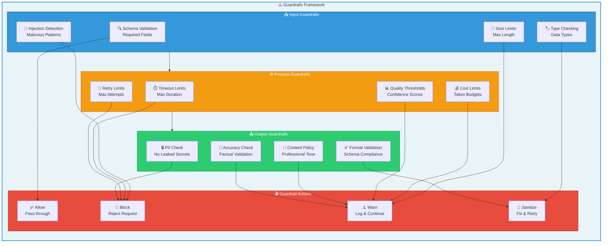
```mermaid
graph TB
    subgraph GuardrailsFramework["⚠️ Guardrails Framework"]
        direction TB
        
        subgraph InputGuardrails["📥 Input Guardrails"]
            I1["🔍 Schema Validation<br/>Required Fields"]
            I2["🚫 Injection Detection<br/>Malicious Patterns"]
            I3["📏 Size Limits<br/>Max Length"]
            I4["🏷️ Type Checking<br/>Data Types"]
        end
        
        subgraph ProcessGuardrails["⚙️ Process Guardrails"]
            P1["⏱️ Timeout Limits<br/>Max Duration"]
            P2["💰 Cost Limits<br/>Token Budgets"]
            P3["🔄 Retry Limits<br/>Max Attempts"]
            P4["📊 Quality Thresholds<br/>Confidence Scores"]
        end
        
        subgraph OutputGuardrails["📤 Output Guardrails"]
            O1["🔒 PII Check<br/>No Leaked Secrets"]
            O2["✅ Format Validation<br/>Schema Compliance"]
            O3["📝 Content Policy<br/>Professional Tone"]
            O4["🎯 Accuracy Check<br/>Factual Validation"]
        end
        
        subgraph Actions["🎬 Guardrail Actions"]
            A1["✅ Allow<br/>Pass through"]
            A2["⚠️ Warn<br/>Log & Continue"]
            A3["🛑 Block<br/>Reject Request"]
            A4["🔧 Sanitize<br/>Fix & Retry"]
        end
    end
    
    InputGuardrails --> ProcessGuardrails
    ProcessGuardrails --> OutputGuardrails
    
    I1 --> A1
    I2 --> A3
    I3 --> A2
    I4 --> A4
    
    P1 --> A3
    P2 --> A2
    P3 --> A3
    P4 --> A2
    
    O1 --> A3
    O2 --> A4
    O3 --> A2
    O4 --> A2

    style GuardrailsFramework fill:#E8F4F8,stroke:#0078D4,stroke-width:2px,color:#333
    style InputGuardrails fill:#3498DB,stroke:#2874A6,stroke-width:2px,color:#fff
    style ProcessGuardrails fill:#F39C12,stroke:#E67E22,stroke-width:2px,color:#fff
    style OutputGuardrails fill:#2ECC71,stroke:#27AE60,stroke-width:2px,color:#fff
    style Actions fill:#E74C3C,stroke:#C0392B,stroke-width:2px,color:#fff
```

**Guardrails Implementation**

```python
from typing import Any, Dict, Optional
from enum import Enum
from pydantic import BaseModel, validator

class GuardrailAction(Enum):
    ALLOW = "allow"
    WARN = "warn"
    BLOCK = "block"
    SANITIZE = "sanitize"

class GuardrailResult(BaseModel):
    action: GuardrailAction
    passed: bool
    violations: List[str]
    sanitized_data: Optional[Any] = None
    metadata: Dict = {}

class GuardrailEngine:
    """Comprehensive guardrails for AI agent safety"""
    
    def __init__(self):
        self.input_guardrails = InputGuardrails()
        self.process_guardrails = ProcessGuardrails()
        self.output_guardrails = OutputGuardrails()
    
    async def validate_input(self, data: Dict) -> GuardrailResult:
        """Validate input against all input guardrails"""
        violations = []
        
        # Schema validation
        if not self.input_guardrails.validate_schema(data):
            violations.append("Schema validation failed")
        
        # Injection detection
        if self.input_guardrails.detect_injection(data):
            violations.append("Potential injection attack detected")
            return GuardrailResult(
                action=GuardrailAction.BLOCK,
                passed=False,
                violations=violations
            )
        
        # Size limits
        if self.input_guardrails.check_size_limits(data):
            violations.append("Input size exceeds limits")
        
        # Type checking
        sanitized_data = self.input_guardrails.validate_types(data)
        
        if violations:
            if "injection" in str(violations).lower():
                return GuardrailResult(
                    action=GuardrailAction.BLOCK,
                    passed=False,
                    violations=violations
                )
            else:
                return GuardrailResult(
                    action=GuardrailAction.SANITIZE,
                    passed=False,
                    violations=violations,
                    sanitized_data=sanitized_data
                )
        
        return GuardrailResult(
            action=GuardrailAction.ALLOW,
            passed=True,
            violations=[]
        )
    
    async def validate_output(self, output: Dict) -> GuardrailResult:
        """Validate output against all output guardrails"""
        violations = []
        
        # PII check
        if self.output_guardrails.contains_pii(output):
            violations.append("Output contains PII")
            # Redact PII automatically
            sanitized_output = self.output_guardrails.redact_pii(output)
            return GuardrailResult(
                action=GuardrailAction.SANITIZE,
                passed=False,
                violations=violations,
                sanitized_data=sanitized_output
            )
        
        # Format validation
        if not self.output_guardrails.validate_format(output):
            violations.append("Output format invalid")
        
        # Content policy
        if not self.output_guardrails.check_content_policy(output):
            violations.append("Output violates content policy")
        
        # Accuracy check
        accuracy_score = self.output_guardrails.check_accuracy(output)
        if accuracy_score < 0.7:
            violations.append(f"Low accuracy score: {accuracy_score}")
        
        if violations:
            return GuardrailResult(
                action=GuardrailAction.WARN,
                passed=False,
                violations=violations,
                metadata={'accuracy_score': accuracy_score}
            )
        
        return GuardrailResult(
            action=GuardrailAction.ALLOW,
            passed=True,
            violations=[]
        )

class InputGuardrails:
    """Input validation guardrails"""
    
    INJECTION_PATTERNS = [
        r'ignore\s+previous\s+instructions',
        r'<\s*script',
        r'eval\s*\(',
        r'exec\s*\(',
        r'__import__',
        r'system\s*\(',
    ]
    
    MAX_INPUT_SIZE = 50000  # characters
    
    def validate_schema(self, data: Dict) -> bool:
        """Validate required fields and structure"""
        required_fields = ['incident_id', 'content']
        return all(field in data for field in required_fields)
    
    def detect_injection(self, data: Dict) -> bool:
        """Detect potential injection attacks"""
        text = json.dumps(data).lower()
        
        for pattern in self.INJECTION_PATTERNS:
            if re.search(pattern, text, re.IGNORECASE):
                logger.warning(f"Injection pattern detected: {pattern}")
                return True
        
        return False
    
    def check_size_limits(self, data: Dict) -> bool:
        """Check if input exceeds size limits"""
        text = json.dumps(data)
        return len(text) > self.MAX_INPUT_SIZE
    
    def validate_types(self, data: Dict) -> Dict:
        """Validate and sanitize data types"""
        sanitized = {}
        
        for key, value in data.items():
            # Strip dangerous characters
            if isinstance(value, str):
                sanitized[key] = value.strip()
            else:
                sanitized[key] = value
        
        return sanitized

class OutputGuardrails:
    """Output validation guardrails"""
    
    def contains_pii(self, output: Dict) -> bool:
        """Check if output contains PII"""
        text = json.dumps(output)
        
        # Check for email patterns
        if re.search(r'\b[A-Za-z0-9._%+-]+@[A-Za-z0-9.-]+\.[A-Z|a-z]{2,}\b', text):
            return True
        
        # Check for phone patterns
        if re.search(r'\b\d{3}[-.]?\d{3}[-.]?\d{4}\b', text):
            return True
        
        return False
    
    def redact_pii(self, output: Dict) -> Dict:
        """Redact PII from output"""
        pii_service = PIIRedactionService()
        text = json.dumps(output)
        redacted_text, _ = pii_service.detect_and_redact(text)
        return json.loads(redacted_text)
    
    def validate_format(self, output: Dict) -> bool:
        """Validate output format and structure"""
        required_fields = ['incident_id', 'result']
        return all(field in output for field in required_fields)
    
    def check_content_policy(self, output: Dict) -> bool:
        """Check against content policy"""
        # Use Azure Content Safety API
        text = json.dumps(output)
        
        # Check for harmful content
        harmful_keywords = ['hack', 'exploit', 'breach']
        return not any(keyword in text.lower() for keyword in harmful_keywords)
    
    def check_accuracy(self, output: Dict) -> float:
        """Validate factual accuracy"""
        # In production, use fact-checking service
        confidence = output.get('confidence', 0.0)
        return confidence
```

##### Prompt Injection Detection

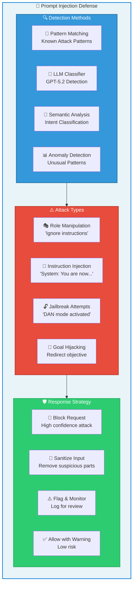
```mermaid
graph TB
    subgraph PromptInjectionDefense["🚫 Prompt Injection Defense"]
        direction TB
        
        subgraph Detection["🔍 Detection Methods"]
            D1["📝 Pattern Matching<br/>Known Attack Patterns"]
            D2["🤖 LLM Classifier<br/>GPT-5.2 Detection"]
            D3["🧠 Semantic Analysis<br/>Intent Classification"]
            D4["📊 Anomaly Detection<br/>Unusual Patterns"]
        end
        
        subgraph AttackTypes["⚠️ Attack Types"]
            AT1["🎭 Role Manipulation<br/>'Ignore instructions'"]
            AT2["💉 Instruction Injection<br/>'System: You are now...'"]
            AT3["🔓 Jailbreak Attempts<br/>'DAN mode activated'"]
            AT4["🎯 Goal Hijacking<br/>Redirect objective"]
        end
        
        subgraph Response["🛡️ Response Strategy"]
            R1["🛑 Block Request<br/>High confidence attack"]
            R2["🧹 Sanitize Input<br/>Remove suspicious parts"]
            R3["⚠️ Flag & Monitor<br/>Log for review"]
            R4["✅ Allow with Warning<br/>Low risk"]
        end
    end
    
    Detection --> AttackTypes
    AttackTypes --> Response

    style PromptInjectionDefense fill:#E8F4F8,stroke:#0078D4,stroke-width:2px,color:#333
    style Detection fill:#3498DB,stroke:#2874A6,stroke-width:2px,color:#fff
    style AttackTypes fill:#E74C3C,stroke:#C0392B,stroke-width:2px,color:#fff
    style Response fill:#2ECC71,stroke:#27AE60,stroke-width:2px,color:#fff
```

**🛡️ Data Control**: Role-based access control (RBAC) for incident data
**📜 Audit Log**: Immutable log of all AI decisions (Azure Event Hubs)

**⚠️ Responsible AI**
- **Content Filtering**: Azure AI Content Safety API
  - Hate speech detection
  - Violence detection
  - Self-harm detection
- **Bias Detection**: Fairness metrics for agent decisions

---

### 5. Specialized Agents Layer 🟩

Three specialized agents for distinct workflow stages.

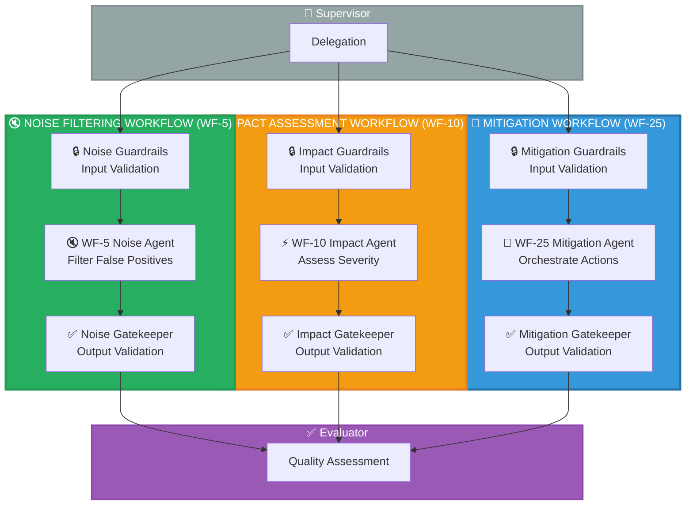
```mermaid
graph TB
    subgraph NoiseWorkflow["🔇 NOISE FILTERING WORKFLOW (WF-5)"]
        direction TB
        NoiseGR["🔒 Noise Guardrails<br/>Input Validation"]
        NoiseAgent["🔇 WF-5 Noise Agent<br/>Filter False Positives"]
        NoiseGatekeeper["✅ Noise Gatekeeper<br/>Output Validation"]
        
        NoiseGR --> NoiseAgent
        NoiseAgent --> NoiseGatekeeper
    end

    subgraph ImpactWorkflow["⚡ IMPACT ASSESSMENT WORKFLOW (WF-10)"]
        direction TB
        ImpactGR["🔒 Impact Guardrails<br/>Input Validation"]
        ImpactAgent["⚡ WF-10 Impact Agent<br/>Assess Severity"]
        ImpactGatekeeper["✅ Impact Gatekeeper<br/>Output Validation"]
        
        ImpactGR --> ImpactAgent
        ImpactAgent --> ImpactGatekeeper
    end

    subgraph MitigationWorkflow["🔧 MITIGATION WORKFLOW (WF-25)"]
        direction TB
        MitigationGR["🔒 Mitigation Guardrails<br/>Input Validation"]
        MitigationAgent["🔧 WF-25 Mitigation Agent<br/>Orchestrate Actions"]
        MitigationGatekeeper["✅ Mitigation Gatekeeper<br/>Output Validation"]
        
        MitigationGR --> MitigationAgent
        MitigationAgent --> MitigationGatekeeper
    end

    subgraph Supervisor["👔 Supervisor"]
        SupervisorCore["Delegation"]
    end

    subgraph Evaluator["✅ Evaluator"]
        EvalCore["Quality Assessment"]
    end

    SupervisorCore --> NoiseGR
    SupervisorCore --> ImpactGR
    SupervisorCore --> MitigationGR
    
    NoiseGatekeeper --> EvalCore
    ImpactGatekeeper --> EvalCore
    MitigationGatekeeper --> EvalCore

    style NoiseWorkflow fill:#27AE60,stroke:#229954,stroke-width:3px,color:#fff
    style ImpactWorkflow fill:#F39C12,stroke:#E67E22,stroke-width:3px,color:#fff
    style MitigationWorkflow fill:#3498DB,stroke:#2874A6,stroke-width:3px,color:#fff
    style Supervisor fill:#95A5A6,stroke:#7F8C8D,stroke-width:2px,color:#fff
    style Evaluator fill:#9B59B6,stroke:#8E44AD,stroke-width:2px,color:#fff
```

#### WF-5: Noise Agent 🔇

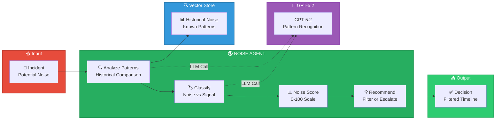
```mermaid
graph LR
    subgraph Input["📥 Input"]
        Incident["🔴 Incident<br/>Potential Noise"]
    end

    subgraph NoiseAgent["🔇 NOISE AGENT"]
        direction TB
        Analyze["🔍 Analyze Patterns<br/>Historical Comparison"]
        Classify["🏷️ Classify<br/>Noise vs Signal"]
        Score["📊 Noise Score<br/>0-100 Scale"]
        Recommend["💡 Recommend<br/>Filter or Escalate"]
    end

    subgraph LLM["🤖 GPT-5.2"]
        Model["GPT-5.2<br/>Pattern Recognition"]
    end

    subgraph VectorDB["🔍 Vector Store"]
        HistoricalNoise["📊 Historical Noise<br/>Known Patterns"]
    end

    subgraph Output["📤 Output"]
        Decision["✅ Decision<br/>Filtered Timeline"]
    end

    Incident --> Analyze
    Analyze --> Classify
    Classify --> Score
    Score --> Recommend
    
    Analyze -.->|LLM Call| Model
    Classify -.->|LLM Call| Model
    
    Analyze --> HistoricalNoise
    
    Recommend --> Decision

    style Input fill:#E74C3C,stroke:#C0392B,stroke-width:2px,color:#fff
    style NoiseAgent fill:#27AE60,stroke:#229954,stroke-width:3px,color:#fff
    style LLM fill:#9B59B6,stroke:#8E44AD,stroke-width:2px,color:#fff
    style VectorDB fill:#3498DB,stroke:#2874A6,stroke-width:2px,color:#fff
    style Output fill:#2ECC71,stroke:#27AE60,stroke-width:2px,color:#fff
```

**Purpose**: Filter false positives and noise from incident stream

**Capabilities**:
- Pattern recognition for recurring non-issues
- Historical comparison with known noise patterns
- Confidence scoring (0-100)
- Automatic filtering or escalation recommendation

**Algorithm**:
1. Extract incident features (keywords, service, frequency)
2. Search vector store for similar historical incidents
3. LLM classification: noise vs. signal
4. Calculate noise score based on:
   - Historical noise rate (40%)
   - Pattern similarity (30%)
   - Frequency/recurrence (20%)
   - User feedback (10%)
5. Decision: Filter (score > 70) or Escalate (score ≤ 70)

**Output**:
```json
{
  "incident_id": "INC-2026-001234",
  "noise_score": 85,
  "classification": "noise",
  "confidence": 0.92,
  "reasoning": "Similar pattern detected in 47 historical incidents, all marked as noise",
  "recommendation": "filter",
  "similar_incidents": ["INC-2026-001100", "INC-2026-001050"]
}
```

#### WF-10: Impact Agent ⚡

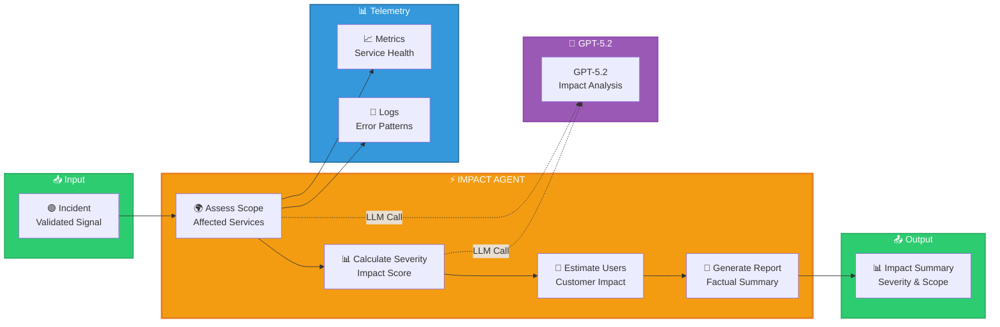
```mermaid
graph LR
    subgraph Input["📥 Input"]
        Incident["🟢 Incident<br/>Validated Signal"]
    end

    subgraph ImpactAgent["⚡ IMPACT AGENT"]
        direction TB
        AssessScope["🌍 Assess Scope<br/>Affected Services"]
        CalculateSeverity["📊 Calculate Severity<br/>Impact Score"]
        EstimateUsers["👥 Estimate Users<br/>Customer Impact"]
        GenerateReport["📝 Generate Report<br/>Factual Summary"]
    end

    subgraph LLM["🤖 GPT-5.2"]
        Model["GPT-5.2<br/>Impact Analysis"]
    end

    subgraph Telemetry["📊 Telemetry"]
        Metrics["📈 Metrics<br/>Service Health"]
        Logs["📜 Logs<br/>Error Patterns"]
    end

    subgraph Output["📤 Output"]
        ImpactReport["📊 Impact Summary<br/>Severity & Scope"]
    end

    Incident --> AssessScope
    AssessScope --> CalculateSeverity
    CalculateSeverity --> EstimateUsers
    EstimateUsers --> GenerateReport
    
    AssessScope -.->|LLM Call| Model
    CalculateSeverity -.->|LLM Call| Model
    
    AssessScope --> Metrics
    AssessScope --> Logs
    
    GenerateReport --> ImpactReport

    style Input fill:#2ECC71,stroke:#27AE60,stroke-width:2px,color:#fff
    style ImpactAgent fill:#F39C12,stroke:#E67E22,stroke-width:3px,color:#fff
    style LLM fill:#9B59B6,stroke:#8E44AD,stroke-width:2px,color:#fff
    style Telemetry fill:#3498DB,stroke:#2874A6,stroke-width:2px,color:#fff
    style Output fill:#2ECC71,stroke:#27AE60,stroke-width:2px,color:#fff
```

**Purpose**: Assess incident severity and customer impact

**Capabilities**:
- Multi-dimensional impact analysis
- Service dependency mapping
- Customer impact estimation
- Severity scoring (P0-P4)

**Impact Dimensions**:
1. **Scope**: Number of affected services/components
2. **Severity**: Error rate, latency degradation
3. **User Impact**: Estimated affected users
4. **Business Impact**: Revenue, SLA, reputation
5. **Duration**: Time to detect + estimated time to resolve

**Severity Calculation**:
```python
severity_score = (
    scope_weight * scope_score +
    error_rate_weight * error_rate_score +
    user_impact_weight * user_impact_score +
    business_impact_weight * business_impact_score
)

if severity_score >= 90: priority = "P0"  # Critical
elif severity_score >= 70: priority = "P1"  # High
elif severity_score >= 50: priority = "P2"  # Medium
elif severity_score >= 30: priority = "P3"  # Low
else: priority = "P4"  # Informational
```

**Output**:
```json
{
  "incident_id": "INC-2026-001234",
  "severity": "P1",
  "severity_score": 78,
  "affected_services": ["api-gateway", "user-service", "payment-service"],
  "estimated_affected_users": 15000,
  "business_impact": "high",
  "estimated_revenue_loss": "$5000/hour",
  "sla_breach_risk": "yes",
  "summary": "High-severity incident affecting 3 critical services and ~15K users..."
}
```

#### WF-25: Mitigation Agent 🔧

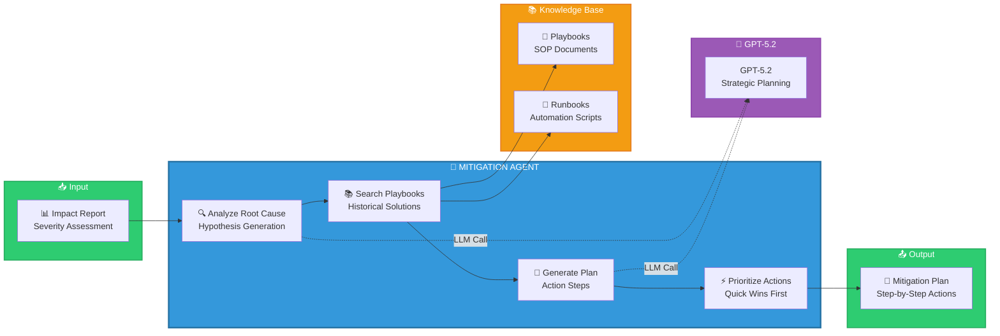
```mermaid
graph LR
    subgraph Input["📥 Input"]
        ImpactReport["📊 Impact Report<br/>Severity Assessment"]
    end

    subgraph MitigationAgent["🔧 MITIGATION AGENT"]
        direction TB
        AnalyzeRoot["🔍 Analyze Root Cause<br/>Hypothesis Generation"]
        SearchPlaybooks["📚 Search Playbooks<br/>Historical Solutions"]
        GeneratePlan["📝 Generate Plan<br/>Action Steps"]
        PrioritizeActions["⚡ Prioritize Actions<br/>Quick Wins First"]
    end

    subgraph LLM["🤖 GPT-5.2"]
        Model["GPT-5.2<br/>Strategic Planning"]
    end

    subgraph KnowledgeBase["📚 Knowledge Base"]
        Playbooks["📖 Playbooks<br/>SOP Documents"]
        Runbooks["🔧 Runbooks<br/>Automation Scripts"]
    end

    subgraph Output["📤 Output"]
        ActionPlan["📝 Mitigation Plan<br/>Step-by-Step Actions"]
    end

    ImpactReport --> AnalyzeRoot
    AnalyzeRoot --> SearchPlaybooks
    SearchPlaybooks --> GeneratePlan
    GeneratePlan --> PrioritizeActions
    
    AnalyzeRoot -.->|LLM Call| Model
    GeneratePlan -.->|LLM Call| Model
    
    SearchPlaybooks --> Playbooks
    SearchPlaybooks --> Runbooks
    
    PrioritizeActions --> ActionPlan

    style Input fill:#2ECC71,stroke:#27AE60,stroke-width:2px,color:#fff
    style MitigationAgent fill:#3498DB,stroke:#2874A6,stroke-width:3px,color:#fff
    style LLM fill:#9B59B6,stroke:#8E44AD,stroke-width:2px,color:#fff
    style KnowledgeBase fill:#F39C12,stroke:#E67E22,stroke-width:2px,color:#fff
    style Output fill:#2ECC71,stroke:#27AE60,stroke-width:2px,color:#fff
```

**Purpose**: Generate actionable mitigation plans and orchestrate remediation

**Capabilities**:
- Root cause hypothesis generation
- Playbook/runbook search and retrieval
- Multi-step action plan generation
- Automation script execution (with approval)

**Mitigation Strategy**:
1. **Immediate Actions** (0-15 min): Stop the bleeding
   - Rollback recent deployments
   - Scale up resources
   - Enable circuit breakers
2. **Short-term Actions** (15-60 min): Stabilize
   - Apply hotfixes
   - Reroute traffic
   - Engage on-call engineers
3. **Long-term Actions** (1+ hours): Resolve
   - Deploy permanent fix
   - Update monitoring
   - Post-mortem analysis

**Output**:
```json
{
  "incident_id": "INC-2026-001234",
  "root_cause_hypothesis": "Database connection pool exhaustion due to traffic spike",
  "mitigation_plan": {
    "immediate_actions": [
      {
        "action": "Scale up database connection pool",
        "estimated_time": "5 minutes",
        "automation_available": true,
        "runbook": "runbooks/scale-db-pool.yaml"
      }
    ],
    "short_term_actions": [...],
    "long_term_actions": [...]
  },
  "estimated_resolution_time": "45 minutes",
  "confidence": 0.85
}
```

---

### 6. Observability & Control Layer 🟨

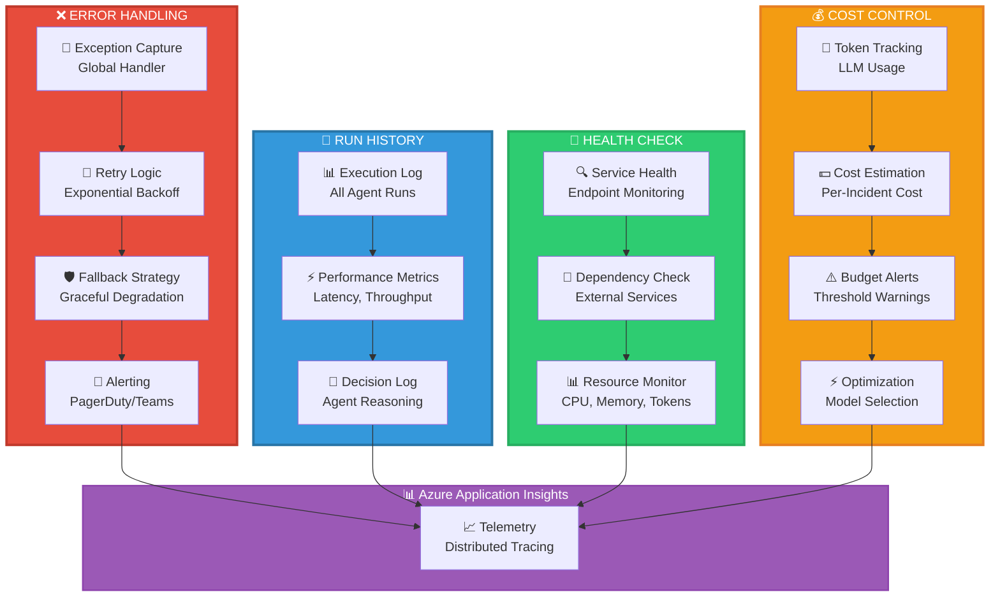
```mermaid
graph TB
    subgraph ErrorHandling["❌ ERROR HANDLING"]
        direction TB
        ExceptionCapture["🎯 Exception Capture<br/>Global Handler"]
        RetryLogic["🔄 Retry Logic<br/>Exponential Backoff"]
        FallbackStrategy["🛡️ Fallback Strategy<br/>Graceful Degradation"]
        Alerting["🚨 Alerting<br/>PagerDuty/Teams"]
    end

    subgraph RunHistory["📜 RUN HISTORY"]
        direction TB
        ExecutionLog["📊 Execution Log<br/>All Agent Runs"]
        PerformanceMetrics["⚡ Performance Metrics<br/>Latency, Throughput"]
        DecisionLog["🧠 Decision Log<br/>Agent Reasoning"]
    end

    subgraph HealthCheck["💚 HEALTH CHECK"]
        direction TB
        ServiceHealth["🔍 Service Health<br/>Endpoint Monitoring"]
        DependencyCheck["🔗 Dependency Check<br/>External Services"]
        ResourceMonitor["📊 Resource Monitor<br/>CPU, Memory, Tokens"]
    end

    subgraph CostControl["💰 COST CONTROL"]
        direction TB
        TokenTracking["🎫 Token Tracking<br/>LLM Usage"]
        CostEstimation["💵 Cost Estimation<br/>Per-Incident Cost"]
        BudgetAlerts["⚠️ Budget Alerts<br/>Threshold Warnings"]
        Optimization["⚡ Optimization<br/>Model Selection"]
    end

    subgraph AppInsights["📊 Azure Application Insights"]
        Telemetry["📈 Telemetry<br/>Distributed Tracing"]
    end

    ExceptionCapture --> RetryLogic
    RetryLogic --> FallbackStrategy
    FallbackStrategy --> Alerting
    
    ExecutionLog --> PerformanceMetrics
    PerformanceMetrics --> DecisionLog
    
    ServiceHealth --> DependencyCheck
    DependencyCheck --> ResourceMonitor
    
    TokenTracking --> CostEstimation
    CostEstimation --> BudgetAlerts
    BudgetAlerts --> Optimization
    
    Alerting --> Telemetry
    DecisionLog --> Telemetry
    ResourceMonitor --> Telemetry
    Optimization --> Telemetry

    style ErrorHandling fill:#E74C3C,stroke:#C0392B,stroke-width:3px,color:#fff
    style RunHistory fill:#3498DB,stroke:#2874A6,stroke-width:3px,color:#fff
    style HealthCheck fill:#2ECC71,stroke:#27AE60,stroke-width:3px,color:#fff
    style CostControl fill:#F39C12,stroke:#E67E22,stroke-width:3px,color:#fff
    style AppInsights fill:#9B59B6,stroke:#8E44AD,stroke-width:2px,color:#fff
```

#### Components

**❌ Error Handling**

The Error Handling system provides comprehensive fault tolerance and resilience across all agents.

##### Exception Taxonomy

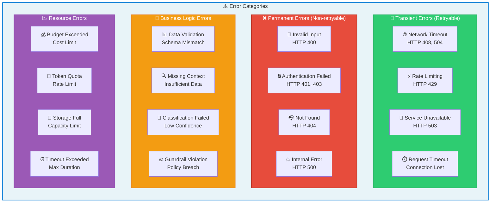
```mermaid
graph TB
    subgraph Errors["⚠️ Error Categories"]
        direction TB
        
        subgraph Transient["🔄 Transient Errors (Retryable)"]
            T1["🌐 Network Timeout<br/>HTTP 408, 504"]
            T2["⚡ Rate Limiting<br/>HTTP 429"]
            T3["🔌 Service Unavailable<br/>HTTP 503"]
            T4["⏱️ Request Timeout<br/>Connection Lost"]
        end
        
        subgraph Permanent["❌ Permanent Errors (Non-retryable)"]
            P1["🚫 Invalid Input<br/>HTTP 400"]
            P2["🔒 Authentication Failed<br/>HTTP 401, 403"]
            P3["📭 Not Found<br/>HTTP 404"]
            P4["💥 Internal Error<br/>HTTP 500"]
        end
        
        subgraph Business["💼 Business Logic Errors"]
            B1["📊 Data Validation<br/>Schema Mismatch"]
            B2["🔍 Missing Context<br/>Insufficient Data"]
            B3["🎯 Classification Failed<br/>Low Confidence"]
            B4["⚖️ Guardrail Violation<br/>Policy Breach"]
        end
        
        subgraph Resource["📉 Resource Errors"]
            R1["💰 Budget Exceeded<br/>Cost Limit"]
            R2["🎫 Token Quota<br/>Rate Limit"]
            R3["💾 Storage Full<br/>Capacity Limit"]
            R4["⏰ Timeout Exceeded<br/>Max Duration"]
        end
    end

    style Errors fill:#E8F4F8,stroke:#0078D4,stroke-width:2px,color:#333
    style Transient fill:#2ECC71,stroke:#27AE60,stroke-width:2px,color:#fff
    style Permanent fill:#E74C3C,stroke:#C0392B,stroke-width:2px,color:#fff
    style Business fill:#F39C12,stroke:#E67E22,stroke-width:2px,color:#fff
    style Resource fill:#9B59B6,stroke:#8E44AD,stroke-width:2px,color:#fff
```

##### Error Handling Flow

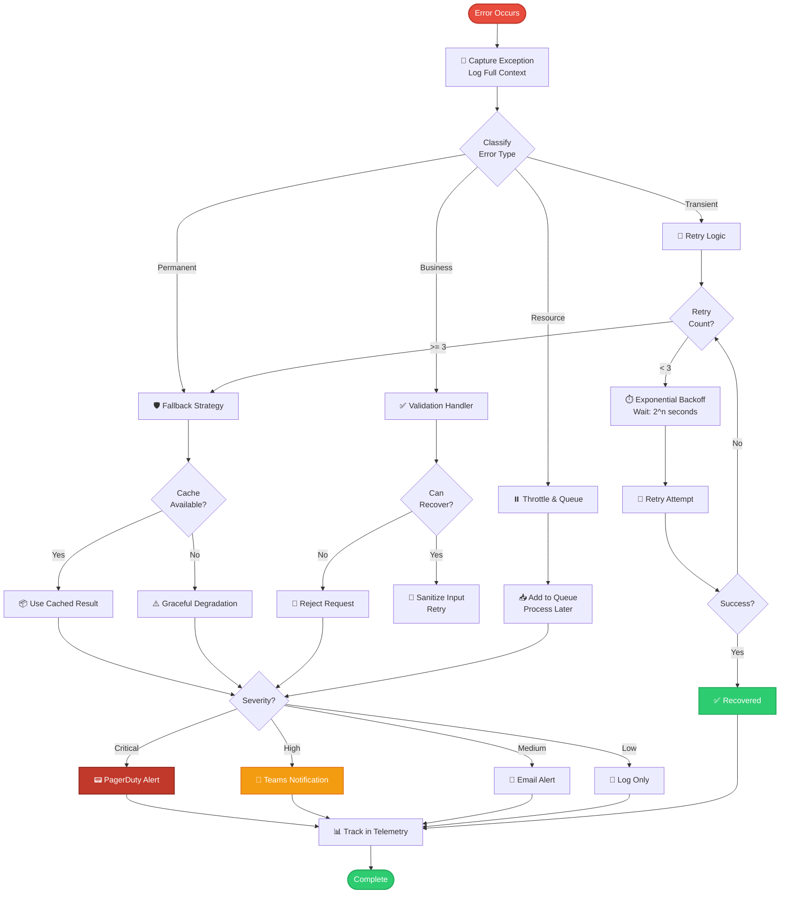
```mermaid
flowchart TD
    Start([Error Occurs]) --> Capture[🎯 Capture Exception<br/>Log Full Context]
    
    Capture --> Classify{Classify<br/>Error Type}
    
    Classify -->|Transient| Retry[🔄 Retry Logic]
    Classify -->|Permanent| Fallback[🛡️ Fallback Strategy]
    Classify -->|Business| Validate[✅ Validation Handler]
    Classify -->|Resource| Throttle[⏸️ Throttle & Queue]
    
    Retry --> RetryCount{Retry<br/>Count?}
    RetryCount -->|< 3| Backoff[⏱️ Exponential Backoff<br/>Wait: 2^n seconds]
    RetryCount -->|>= 3| Fallback
    
    Backoff --> Attempt[🔄 Retry Attempt]
    Attempt --> Success{Success?}
    Success -->|Yes| Recover[✅ Recovered]
    Success -->|No| RetryCount
    
    Fallback --> CheckCache{Cache<br/>Available?}
    CheckCache -->|Yes| UseCache[📦 Use Cached Result]
    CheckCache -->|No| Degrade[⚠️ Graceful Degradation]
    
    Validate --> CanRecover{Can<br/>Recover?}
    CanRecover -->|Yes| Sanitize[🧹 Sanitize Input<br/>Retry]
    CanRecover -->|No| RejectRequest[🚫 Reject Request]
    
    Throttle --> Queue[📥 Add to Queue<br/>Process Later]
    
    UseCache --> Alert{Severity?}
    Degrade --> Alert
    RejectRequest --> Alert
    Queue --> Alert
    
    Alert -->|Critical| PagerDuty[📟 PagerDuty Alert]
    Alert -->|High| Teams[💬 Teams Notification]
    Alert -->|Medium| Email[📧 Email Alert]
    Alert -->|Low| Log[📝 Log Only]
    
    PagerDuty --> Track[📊 Track in Telemetry]
    Teams --> Track
    Email --> Track
    Log --> Track
    Recover --> Track
    
    Track --> End([Complete])

    style Start fill:#E74C3C,stroke:#C0392B,stroke-width:2px,color:#fff
    style End fill:#2ECC71,stroke:#27AE60,stroke-width:2px,color:#fff
    style Recover fill:#2ECC71,stroke:#27AE60,stroke-width:2px,color:#fff
    style PagerDuty fill:#C0392B,stroke:#922B21,stroke-width:2px,color:#fff
    style Teams fill:#F39C12,stroke:#E67E22,stroke-width:2px,color:#fff
```

##### Retry Strategy

**Exponential Backoff with Jitter**

```python
import random
import asyncio
from typing import Callable, TypeVar

T = TypeVar('T')

async def retry_with_backoff(
    func: Callable[..., T],
    max_retries: int = 3,
    base_delay: float = 1.0,
    max_delay: float = 60.0,
    jitter: bool = True
) -> T:
    """
    Retry function with exponential backoff and jitter
    
    Formula: delay = min(base_delay * (2 ** attempt), max_delay)
    With jitter: delay = delay * random.uniform(0.5, 1.5)
    """
    for attempt in range(max_retries):
        try:
            return await func()
        except TransientError as e:
            if attempt == max_retries - 1:
                raise MaxRetriesExceeded(f"Failed after {max_retries} attempts") from e
            
            # Calculate delay
            delay = min(base_delay * (2 ** attempt), max_delay)
            
            # Add jitter to prevent thundering herd
            if jitter:
                delay *= random.uniform(0.5, 1.5)
            
            logger.warning(
                f"Attempt {attempt + 1}/{max_retries} failed. "
                f"Retrying in {delay:.2f}s. Error: {e}"
            )
            
            await asyncio.sleep(delay)
```

**Retry Decision Matrix**

| Error Type | Retry? | Max Attempts | Backoff | Jitter |
|------------|--------|--------------|---------|--------|
| Network Timeout | ✅ Yes | 3 | Exponential | Yes |
| Rate Limiting | ✅ Yes | 5 | Exponential | Yes |
| Service Unavailable | ✅ Yes | 3 | Exponential | Yes |
| Authentication Failed | ❌ No | 0 | N/A | N/A |
| Invalid Input | ❌ No | 0 | N/A | N/A |
| Internal Error | ⚠️ Maybe | 1 | Fixed (5s) | No |

##### Circuit Breaker Pattern

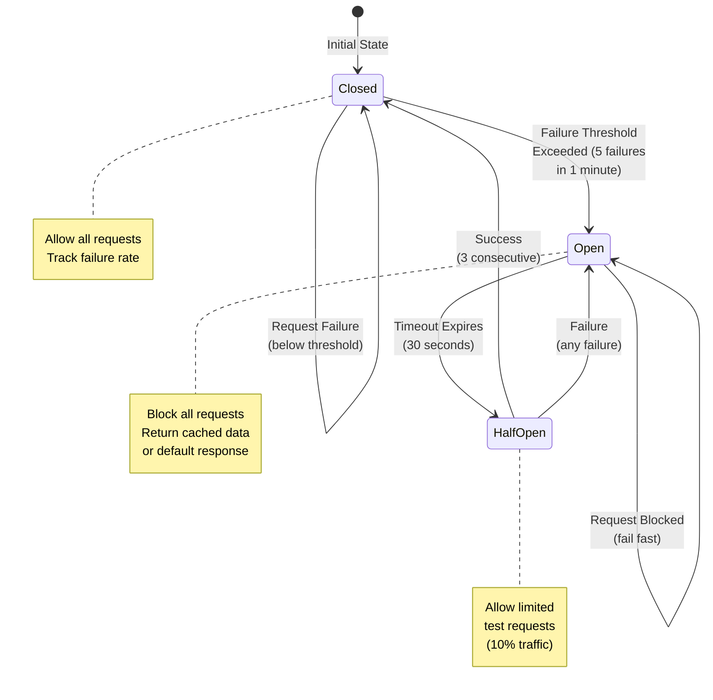
```mermaid
stateDiagram-v2
    [*] --> Closed: Initial State
    
    Closed --> Open: Failure Threshold<br/>Exceeded (5 failures<br/>in 1 minute)
    
    Open --> HalfOpen: Timeout Expires<br/>(30 seconds)
    
    HalfOpen --> Closed: Success<br/>(3 consecutive)
    HalfOpen --> Open: Failure<br/>(any failure)
    
    Closed --> Closed: Request Success
    Closed --> Closed: Request Failure<br/>(below threshold)
    
    Open --> Open: Request Blocked<br/>(fail fast)
    
    note right of Closed
        Allow all requests
        Track failure rate
    end note
    
    note right of Open
        Block all requests
        Return cached data
        or default response
    end note
    
    note right of HalfOpen
        Allow limited
        test requests
        (10% traffic)
    end note
```

**Circuit Breaker Configuration**

```python
from typing import Optional
from datetime import datetime, timedelta
from enum import Enum

class CircuitState(Enum):
    CLOSED = "closed"
    OPEN = "open"
    HALF_OPEN = "half_open"

class CircuitBreaker:
    def __init__(
        self,
        failure_threshold: int = 5,
        timeout_duration: int = 30,
        success_threshold: int = 3,
        monitoring_window: int = 60
    ):
        self.failure_threshold = failure_threshold
        self.timeout_duration = timeout_duration
        self.success_threshold = success_threshold
        self.monitoring_window = monitoring_window
        
        self.state = CircuitState.CLOSED
        self.failure_count = 0
        self.success_count = 0
        self.last_failure_time: Optional[datetime] = None
    
    async def call(self, func, *args, **kwargs):
        """Execute function with circuit breaker protection"""
        
        if self.state == CircuitState.OPEN:
            # Check if timeout expired
            if datetime.now() - self.last_failure_time > timedelta(seconds=self.timeout_duration):
                self.state = CircuitState.HALF_OPEN
                self.success_count = 0
            else:
                raise CircuitOpenError("Circuit breaker is OPEN")
        
        try:
            result = await func(*args, **kwargs)
            self._on_success()
            return result
        except Exception as e:
            self._on_failure()
            raise
    
    def _on_success(self):
        """Handle successful request"""
        if self.state == CircuitState.HALF_OPEN:
            self.success_count += 1
            if self.success_count >= self.success_threshold:
                self.state = CircuitState.CLOSED
                self.failure_count = 0
        elif self.state == CircuitState.CLOSED:
            # Reset failure count on success
            self.failure_count = max(0, self.failure_count - 1)
    
    def _on_failure(self):
        """Handle failed request"""
        self.failure_count += 1
        self.last_failure_time = datetime.now()
        
        if self.state == CircuitState.HALF_OPEN:
            self.state = CircuitState.OPEN
        elif self.state == CircuitState.CLOSED:
            if self.failure_count >= self.failure_threshold:
                self.state = CircuitState.OPEN
```

##### Fallback Strategies

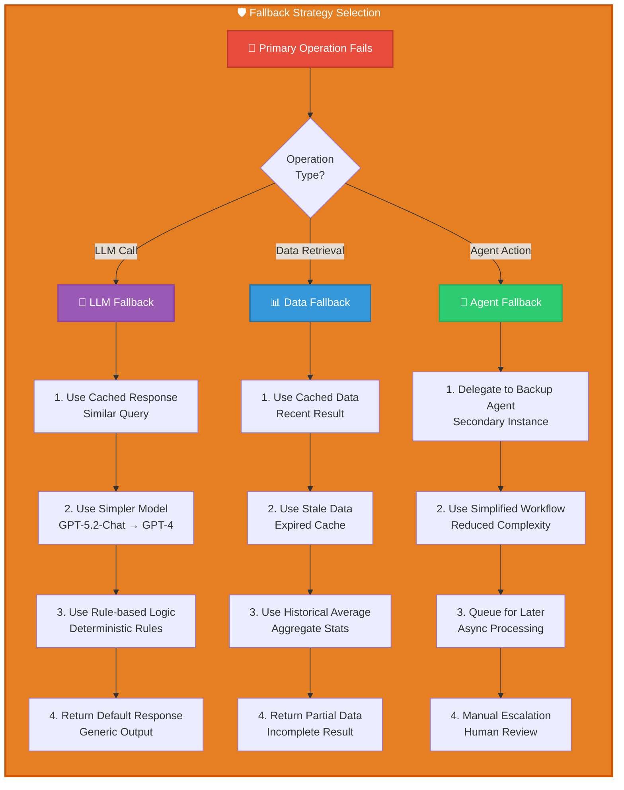
```mermaid
graph TB
    subgraph FallbackOptions["🛡️ Fallback Strategy Selection"]
        direction TB
        
        Primary[🎯 Primary Operation Fails]
        
        Primary --> CheckType{Operation<br/>Type?}
        
        CheckType -->|LLM Call| LLMFallback[🤖 LLM Fallback]
        CheckType -->|Data Retrieval| DataFallback[📊 Data Fallback]
        CheckType -->|Agent Action| AgentFallback[🤖 Agent Fallback]
        
        LLMFallback --> L1[1. Use Cached Response<br/>Similar Query]
        L1 --> L2[2. Use Simpler Model<br/>GPT-5.2-Chat → GPT-4]
        L2 --> L3[3. Use Rule-based Logic<br/>Deterministic Rules]
        L3 --> L4[4. Return Default Response<br/>Generic Output]
        
        DataFallback --> D1[1. Use Cached Data<br/>Recent Result]
        D1 --> D2[2. Use Stale Data<br/>Expired Cache]
        D2 --> D3[3. Use Historical Average<br/>Aggregate Stats]
        D3 --> D4[4. Return Partial Data<br/>Incomplete Result]
        
        AgentFallback --> A1[1. Delegate to Backup Agent<br/>Secondary Instance]
        A1 --> A2[2. Use Simplified Workflow<br/>Reduced Complexity]
        A2 --> A3[3. Queue for Later<br/>Async Processing]
        A3 --> A4[4. Manual Escalation<br/>Human Review]
    end

    style FallbackOptions fill:#E67E22,stroke:#D35400,stroke-width:3px,color:#fff
    style Primary fill:#E74C3C,stroke:#C0392B,stroke-width:2px,color:#fff
    style LLMFallback fill:#9B59B6,stroke:#8E44AD,stroke-width:2px,color:#fff
    style DataFallback fill:#3498DB,stroke:#2874A6,stroke-width:2px,color:#fff
    style AgentFallback fill:#2ECC71,stroke:#27AE60,stroke-width:2px,color:#fff
```

**Fallback Implementation Example**

```python
from typing import Optional, Any
import hashlib
import json

class FallbackHandler:
    def __init__(self, cache_ttl: int = 3600):
        self.cache_ttl = cache_ttl
    
    async def call_with_fallback(
        self,
        primary_func,
        fallback_chain: list,
        context: dict
    ) -> tuple[Any, str]:
        """
        Execute primary function with fallback chain
        
        Returns: (result, source)
        source: "primary", "cache", "fallback_1", etc.
        """
        
        # Try primary operation
        try:
            result = await primary_func()
            await self._cache_result(context, result)
            return result, "primary"
        except Exception as primary_error:
            logger.warning(f"Primary operation failed: {primary_error}")
        
        # Try fallback chain in order
        for idx, fallback_func in enumerate(fallback_chain):
            try:
                result = await fallback_func(context, primary_error)
                if result is not None:
                    return result, f"fallback_{idx + 1}"
            except Exception as fallback_error:
                logger.warning(f"Fallback {idx + 1} failed: {fallback_error}")
                continue
        
        # All fallbacks failed
        raise AllFallbacksFailedError("All fallback strategies exhausted")
    
    async def _cache_result(self, context: dict, result: Any):
        """Cache successful result for future fallback"""
        cache_key = self._generate_cache_key(context)
        await redis_client.setex(
            cache_key,
            self.cache_ttl,
            json.dumps(result)
        )

# Usage example
fallback_handler = FallbackHandler()

async def get_incident_classification(incident):
    # Primary: GPT-5.2
    primary = lambda: classify_with_gpt52(incident)
    
    # Fallback chain
    fallbacks = [
        lambda ctx, err: get_cached_classification(ctx),
        lambda ctx, err: classify_with_gpt4(ctx),
        lambda ctx, err: rule_based_classification(ctx),
        lambda ctx, err: default_classification(ctx)
    ]
    
    result, source = await fallback_handler.call_with_fallback(
        primary,
        fallbacks,
        context={"incident": incident}
    )
    
    logger.info(f"Classification source: {source}")
    return result
```

##### Graceful Degradation


```mermaid
graph LR
    subgraph Full["🟢 Full Functionality"]
        F1["All Agents Active"]
        F2["Real-time LLM Calls"]
        F3["Complete Analysis"]
        F4["High Accuracy"]
    end
    
    subgraph Degraded["🟡 Degraded Mode"]
        D1["Critical Agents Only"]
        D2["Cached Responses"]
        D3["Simplified Analysis"]
        D4["Acceptable Accuracy"]
    end
    
    subgraph Minimal["🟠 Minimal Mode"]
        M1["Supervisor Agent Only"]
        M2["Rule-based Logic"]
        M3["Basic Categorization"]
        M4["Lower Accuracy"]
    end
    
    subgraph Emergency["🔴 Emergency Mode"]
        E1["No Agent Processing"]
        E2["Queue for Later"]
        E3["Manual Review"]
        E4["Fail-safe Mode"]
    end
    
    Full -->|High Error Rate| Degraded
    Degraded -->|Continued Issues| Minimal
    Minimal -->|System Critical| Emergency
    
    Emergency -->|System Recovered| Minimal
    Minimal -->|Stabilized| Degraded
    Degraded -->|Fully Recovered| Full

    style Full fill:#2ECC71,stroke:#27AE60,stroke-width:2px,color:#fff
    style Degraded fill:#F1C40F,stroke:#F39C12,stroke-width:2px,color:#333
    style Minimal fill:#F39C12,stroke:#E67E22,stroke-width:2px,color:#fff
    style Emergency fill:#E74C3C,stroke:#C0392B,stroke-width:2px,color:#fff
```

##### Alerting & Escalation

**Alert Severity Levels**

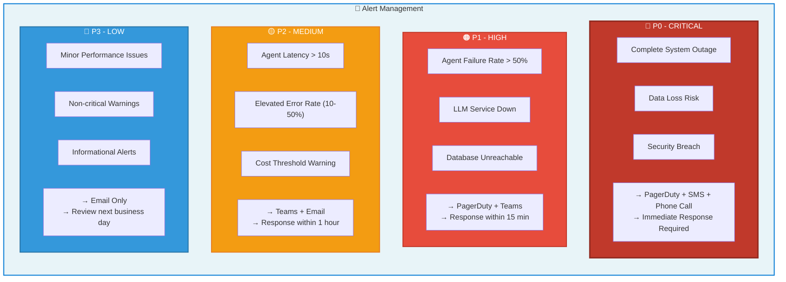
```mermaid
graph TB
    subgraph Alerts["🚨 Alert Management"]
        direction TB
        
        subgraph P0["🔴 P0 - CRITICAL"]
            P0_1["Complete System Outage"]
            P0_2["Data Loss Risk"]
            P0_3["Security Breach"]
            P0_Action["→ PagerDuty + SMS + Phone Call<br/>→ Immediate Response Required"]
        end
        
        subgraph P1["🟠 P1 - HIGH"]
            P1_1["Agent Failure Rate > 50%"]
            P1_2["LLM Service Down"]
            P1_3["Database Unreachable"]
            P1_Action["→ PagerDuty + Teams<br/>→ Response within 15 min"]
        end
        
        subgraph P2["🟡 P2 - MEDIUM"]
            P2_1["Agent Latency > 10s"]
            P2_2["Elevated Error Rate (10-50%)"]
            P2_3["Cost Threshold Warning"]
            P2_Action["→ Teams + Email<br/>→ Response within 1 hour"]
        end
        
        subgraph P3["🔵 P3 - LOW"]
            P3_1["Minor Performance Issues"]
            P3_2["Non-critical Warnings"]
            P3_3["Informational Alerts"]
            P3_Action["→ Email Only<br/>→ Review next business day"]
        end
    end

    style Alerts fill:#E8F4F8,stroke:#0078D4,stroke-width:2px,color:#333
    style P0 fill:#C0392B,stroke:#922B21,stroke-width:3px,color:#fff
    style P1 fill:#E74C3C,stroke:#C0392B,stroke-width:2px,color:#fff
    style P2 fill:#F39C12,stroke:#E67E22,stroke-width:2px,color:#fff
    style P3 fill:#3498DB,stroke:#2874A6,stroke-width:2px,color:#fff
```

**Notification Routing**

```python
from enum import Enum
from typing import List

class AlertSeverity(Enum):
    P0_CRITICAL = 0
    P1_HIGH = 1
    P2_MEDIUM = 2
    P3_LOW = 3

class AlertManager:
    def __init__(self):
        self.notification_configs = {
            AlertSeverity.P0_CRITICAL: {
                "channels": ["pagerduty", "sms", "phone", "teams", "email"],
                "escalation_timeout": 300,  # 5 minutes
                "escalation_chain": ["oncall_primary", "oncall_secondary", "manager"]
            },
            AlertSeverity.P1_HIGH: {
                "channels": ["pagerduty", "teams", "email"],
                "escalation_timeout": 900,  # 15 minutes
                "escalation_chain": ["oncall_primary", "oncall_secondary"]
            },
            AlertSeverity.P2_MEDIUM: {
                "channels": ["teams", "email"],
                "escalation_timeout": 3600,  # 1 hour
                "escalation_chain": ["team_lead"]
            },
            AlertSeverity.P3_LOW: {
                "channels": ["email"],
                "escalation_timeout": None,
                "escalation_chain": []
            }
        }
    
    async def send_alert(
        self,
        severity: AlertSeverity,
        title: str,
        description: str,
        metadata: dict
    ):
        """Send alert through appropriate channels"""
        config = self.notification_configs[severity]
        
        alert_data = {
            "severity": severity.name,
            "title": title,
            "description": description,
            "timestamp": datetime.now().isoformat(),
            "metadata": metadata
        }
        
        # Send to all configured channels
        for channel in config["channels"]:
            await self._send_to_channel(channel, alert_data)
        
        # Set up escalation if configured
        if config["escalation_timeout"]:
            await self._setup_escalation(
                alert_data,
                config["escalation_chain"],
                config["escalation_timeout"]
            )
```

##### Error Recovery Patterns

**Compensation Transactions**

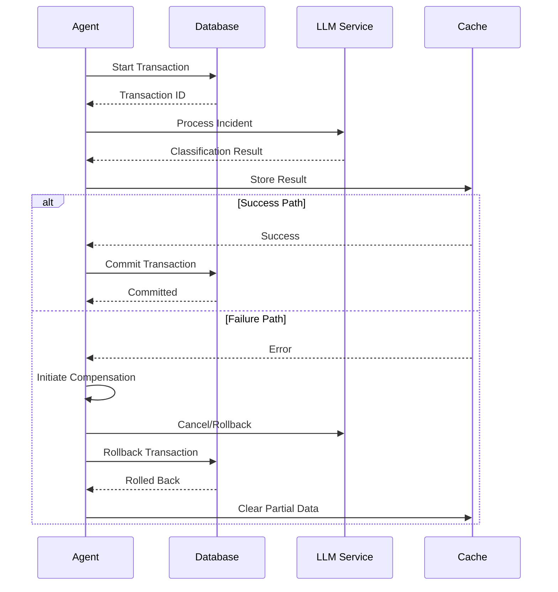
```mermaid
sequenceDiagram
    participant A as Agent
    participant DB as Database
    participant LLM as LLM Service
    participant Cache as Cache
    
    A->>DB: Start Transaction
    DB-->>A: Transaction ID
    
    A->>LLM: Process Incident
    LLM-->>A: Classification Result
    
    A->>Cache: Store Result
    
    alt Success Path
        Cache-->>A: Success
        A->>DB: Commit Transaction
        DB-->>A: Committed
    else Failure Path
        Cache-->>A: Error
        A->>A: Initiate Compensation
        A->>LLM: Cancel/Rollback
        A->>DB: Rollback Transaction
        DB-->>A: Rolled Back
        A->>Cache: Clear Partial Data
    end
```

**Idempotency Pattern**

```python
import hashlib
from typing import Optional

class IdempotencyManager:
    """Ensure operations can be safely retried"""
    
    def __init__(self, ttl: int = 86400):  # 24 hours
        self.ttl = ttl
    
    def generate_idempotency_key(self, operation: str, params: dict) -> str:
        """Generate deterministic key for operation"""
        content = f"{operation}:{json.dumps(params, sort_keys=True)}"
        return hashlib.sha256(content.encode()).hexdigest()
    
    async def execute_idempotent(
        self,
        operation: str,
        params: dict,
        func
    ) -> tuple[Any, bool]:
        """
        Execute operation with idempotency guarantee
        
        Returns: (result, is_cached)
        """
        key = self.generate_idempotency_key(operation, params)
        
        # Check if already executed
        cached_result = await redis_client.get(f"idempotency:{key}")
        if cached_result:
            return json.loads(cached_result), True
        
        # Execute operation
        result = await func()
        
        # Store result for future duplicate requests
        await redis_client.setex(
            f"idempotency:{key}",
            self.ttl,
            json.dumps(result)
        )
        
        return result, False

# Usage
idempotency_mgr = IdempotencyManager()

async def process_incident(incident_id: str, data: dict):
    result, was_cached = await idempotency_mgr.execute_idempotent(
        operation="process_incident",
        params={"incident_id": incident_id, "data": data},
        func=lambda: _do_process_incident(incident_id, data)
    )
    
    if was_cached:
        logger.info(f"Returned cached result for {incident_id}")
    
    return result
```

##### Monitoring & Observability

**Error Metrics Dashboard**

```kusto
// Error rate by agent type
exceptions
| where timestamp > ago(1h)
| summarize 
    error_count = count(),
    unique_errors = dcount(message)
  by agent_type, error_type, bin(timestamp, 5m)
| render timechart

// Retry success rate
customMetrics
| where name == "retry_attempt"
| extend success = tobool(customDimensions.success)
| summarize 
    total_retries = count(),
    successful_retries = countif(success == true),
    success_rate = 100.0 * countif(success == true) / count()
  by bin(timestamp, 5m)
| render timechart

// Circuit breaker state changes
customEvents
| where name == "circuit_breaker_state_change"
| extend 
    service = tostring(customDimensions.service),
    from_state = tostring(customDimensions.from_state),
    to_state = tostring(customDimensions.to_state)
| summarize count() by service, to_state, bin(timestamp, 1h)
| render columnchart
```

**Error Budget**

```mermaid
graph LR
    subgraph ErrorBudget["📊 Monthly Error Budget"]
        Budget["100% Budget<br/>Available Errors"]
        
        Budget --> Consumed1["System Errors: 20%<br/>Network, Timeouts"]
        Budget --> Consumed2["LLM Errors: 15%<br/>Rate Limits, Failures"]
        Budget --> Consumed3["Business Errors: 10%<br/>Validation, Logic"]
        Budget --> Remaining["Remaining: 55%<br/>Buffer for Incidents"]
        
        Consumed1 --> Alert1{">30%?"}
        Consumed2 --> Alert2{">25%?"}
        Consumed3 --> Alert3{">20%?"}
        
        Alert1 -->|Yes| Action1[🚨 Investigate & Fix]
        Alert2 -->|Yes| Action2[🚨 Review LLM Integration]
        Alert3 -->|Yes| Action3[🚨 Improve Validation]
    end

    style ErrorBudget fill:#E8F4F8,stroke:#0078D4,stroke-width:2px,color:#333
    style Budget fill:#2ECC71,stroke:#27AE60,stroke-width:2px,color:#fff
    style Remaining fill:#3498DB,stroke:#2874A6,stroke-width:2px,color:#fff
```

---

**Error Handling Best Practices**

1. **Always Log Context**: Include incident ID, agent type, operation, and relevant parameters
2. **Use Structured Logging**: JSON format for easy parsing and analysis
3. **Implement Dead Letter Queue**: For permanently failed operations
4. **Monitor Error Trends**: Set up anomaly detection on error rates
5. **Test Failure Scenarios**: Chaos engineering, fault injection
6. **Document Known Issues**: Maintain runbook for common errors
7. **Post-Incident Reviews**: Learn from production incidents

**📜 Run History**
- **Execution Log**: Complete audit trail of all agent executions
- **Performance Metrics**: Latency (p50, p95, p99), throughput, error rate
- **Decision Log**: LLM reasoning, tool calls, intermediate results
- **Storage**: Azure Cosmos DB (90-day retention)

**💚 Health Check**
- **Service Health**: HTTP endpoint monitoring (`/health`, `/ready`)
- **Dependency Check**: Azure OpenAI, Cosmos DB, AI Search availability
- **Resource Monitor**: CPU, memory, token quota, rate limits

**💰 Cost Control**
- **Token Tracking**: Count input/output tokens per LLM call
- **Cost Estimation**: Calculate per-incident cost (GPT-5.2 pricing)
- **Budget Alerts**: Notify when approaching daily/monthly limits
- **Optimization**: Auto-select cheaper models for low-priority incidents

**Cost Breakdown**:
```
GPT-5.2 (reasoning): $15/1M input tokens, $60/1M output tokens
GPT-5.2-Chat: $10/1M input tokens, $30/1M output tokens
text-embedding-3-large: $0.13/1M tokens

Average incident cost: $0.25 - $0.75
Daily budget (10K incidents): $2,500 - $7,500
```

---

### 7. Evaluation & Output Layer 🟢

```mermaid
graph TB
    subgraph AgentOutputs["🤖 Agent Outputs"]
        NoiseResult["🔇 Noise Result"]
        ImpactResult["⚡ Impact Result"]
        MitigationResult["🔧 Mitigation Result"]
    end

    subgraph Evaluator["✅ EVALUATOR"]
        direction TB
        QualityCheck["🔍 Quality Check<br/>Completeness, Accuracy"]
        ConsistencyCheck["⚖️ Consistency Check<br/>Cross-Agent Validation"]
        ConfidenceScore["📊 Confidence Score<br/>0-100 Scale"]
        FeedbackLoop["🔄 Feedback Loop<br/>Learning from Errors"]
    end

    subgraph LLM["🤖 GPT-5.2-Chat"]
        Model["GPT-5.2-Chat<br/>Evaluation Model"]
    end

    subgraph OutputLayer["🟢 OUTPUT LAYER"]
        direction TB
        NoiseOutput["📋 Noise Workflow Output<br/>Filtered Timeline"]
        ImpactOutput["📊 Impact Summary<br/>Factual Report"]
        MitigationOutput["📝 Mitigation Workflow<br/>Action Plan"]
    end

    subgraph Delivery["📤 Delivery"]
        API["🔌 REST API"]
        Webhook["🔗 Webhook"]
        Dashboard["📊 Dashboard"]
        Notification["📧 Notification"]
    end

    NoiseResult --> QualityCheck
    ImpactResult --> QualityCheck
    MitigationResult --> QualityCheck
    
    QualityCheck --> ConsistencyCheck
    ConsistencyCheck --> ConfidenceScore
    ConfidenceScore --> FeedbackLoop
    
    QualityCheck -.->|LLM Call| Model
    ConsistencyCheck -.->|LLM Call| Model
    
    FeedbackLoop --> NoiseOutput
    FeedbackLoop --> ImpactOutput
    FeedbackLoop --> MitigationOutput
    
    NoiseOutput --> API
    ImpactOutput --> API
    MitigationOutput --> API
    
    API --> Webhook
    API --> Dashboard
    API --> Notification

    style AgentOutputs fill:#3498DB,stroke:#2874A6,stroke-width:2px,color:#fff
    style Evaluator fill:#9B59B6,stroke:#8E44AD,stroke-width:3px,color:#fff
    style LLM fill:#E74C3C,stroke:#C0392B,stroke-width:2px,color:#fff
    style OutputLayer fill:#2ECC71,stroke:#27AE60,stroke-width:3px,color:#fff
    style Delivery fill:#F39C12,stroke:#E67E22,stroke-width:2px,color:#fff
```

#### Components

**✅ Evaluator**
- **Purpose**: Assess quality and consistency of agent outputs
- **Quality Checks**:
  - Completeness: All required fields present
  - Accuracy: Factual correctness (cross-reference with telemetry)
  - Relevance: Output matches input incident
  - Clarity: Human-readable, actionable
- **Consistency Checks**:
  - Cross-agent validation (e.g., impact severity matches mitigation urgency)
  - Historical comparison (similar incidents had similar outcomes)
- **Confidence Scoring**: 0-100 scale based on quality + consistency
- **Feedback Loop**: Learn from human feedback and corrections

**🟢 Output Layer**
- **Noise Workflow Output**: Filtered timeline with noise incidents removed
- **Impact Summary**: Structured report with severity, scope, user impact
- **Mitigation Workflow**: Step-by-step action plan with automation scripts

**📤 Delivery**
- **REST API**: JSON responses for programmatic access
- **Webhook**: Push notifications to external systems
- **Dashboard**: Web UI for human operators
- **Notification**: Email, Teams, Slack alerts

---

## Data Flow

End-to-end data flow through the system:

```mermaid
sequenceDiagram
    participant User as 👤 User/System
    participant Input as 📥 Input Layer
    participant Summarizer as 📝 Summarizer
    participant Supervisor as 👔 Supervisor
    participant Safety as 🛡️ Safety Layer
    participant NoiseAgent as 🔇 Noise Agent
    participant ImpactAgent as ⚡ Impact Agent
    participant MitigationAgent as 🔧 Mitigation Agent
    participant Evaluator as ✅ Evaluator
    participant Output as 📤 Output Layer

    User->>Input: Submit Incident (email/chat/log)
    Input->>Input: Parse & Validate
    Input->>Summarizer: Raw Incident Data
    
    Summarizer->>Summarizer: Extract Info, Categorize, Normalize
    Summarizer->>Supervisor: Processed Incident
    
    Supervisor->>Safety: Validate (PII, Guardrails)
    Safety-->>Supervisor: Approved
    
    Supervisor->>Supervisor: Plan Workflow
    
    par Parallel Agent Execution
        Supervisor->>NoiseAgent: Check for Noise
        NoiseAgent-->>Supervisor: Noise Score
        
        Supervisor->>ImpactAgent: Assess Impact
        ImpactAgent-->>Supervisor: Impact Report
        
        Supervisor->>MitigationAgent: Generate Plan
        MitigationAgent-->>Supervisor: Action Plan
    end
    
    Supervisor->>Evaluator: Aggregate Results
    Evaluator->>Evaluator: Quality & Consistency Check
    Evaluator->>Output: Final Results
    
    Output->>User: Deliver (API/Webhook/Dashboard)
```

---

## Technology Stack

### Core Technologies

```mermaid
graph TB
    subgraph AI["🤖 AI & LLM"]
        GPT52["GPT-5.2<br/>Reasoning Model"]
        GPT52Chat["GPT-5.2-Chat<br/>Interactive Model"]
        Embeddings["text-embedding-3-large<br/>3072 dimensions"]
    end

    subgraph Framework["🔧 Framework"]
        AgentFramework["Microsoft Agent Framework<br/>v1.0.0b260130"]
        Python["Python 3.11+"]
    end

    subgraph Azure["☁️ Azure Services"]
        AIFoundry["Azure AI Foundry<br/>Model Deployment"]
        AISearch["Azure AI Search<br/>Vector Store"]
        CosmosDB["Azure Cosmos DB<br/>Memory Store"]
        AppInsights["Application Insights<br/>Monitoring"]
        ContainerApps["Container Apps<br/>Hosting"]
    end

    subgraph Data["💾 Data Layer"]
        Redis["Redis<br/>Short-term Cache"]
        EventHubs["Event Hubs<br/>Audit Log"]
    end

    subgraph Observability["📊 Observability"]
        OpenTelemetry["OpenTelemetry<br/>Distributed Tracing"]
        Prometheus["Prometheus<br/>Metrics"]
        Grafana["Grafana<br/>Dashboards"]
    end

    Framework --> AI
    Framework --> Azure
    Azure --> Data
    Azure --> Observability

    style AI fill:#9B59B6,stroke:#8E44AD,stroke-width:3px,color:#fff
    style Framework fill:#3498DB,stroke:#2874A6,stroke-width:3px,color:#fff
    style Azure fill:#00A4EF,stroke:#0078D4,stroke-width:3px,color:#fff
    style Data fill:#F39C12,stroke:#E67E22,stroke-width:3px,color:#fff
    style Observability fill:#2ECC71,stroke:#27AE60,stroke-width:3px,color:#fff
```

### Technology Decisions

| Component | Technology | Rationale |
|-----------|-----------|-----------|
| **LLM** | GPT-5.2 / GPT-5.2-Chat | Latest model with enhanced reasoning and agentic execution |
| **Framework** | Microsoft Agent Framework | Native Azure integration, enterprise-ready |
| **Vector Store** | Azure AI Search | Managed service, hybrid search, enterprise security |
| **Memory** | Azure Cosmos DB | NoSQL, global distribution, low latency |
| **Cache** | Redis | Fast in-memory cache for short-term memory |
| **Monitoring** | Application Insights | Native Azure integration, distributed tracing |
| **Hosting** | Container Apps | Serverless, auto-scaling, cost-effective |
| **Language** | Python 3.11+ | Rich AI/ML ecosystem, async support |

---

## 7. Deployment Strategy

### Deployment Architecture

```mermaid
graph TB
    subgraph CICD["🔄 CI/CD Pipeline"]
        direction LR
        GitHub["📦 GitHub<br/>Source Control"]
        Build["🏗️ Build<br/>Docker Images"]
        Test["🧪 Tests<br/>Unit + Integration"]
        Security["🔒 Security Scan<br/>Trivy + SonarQube"]
        Registry["📦 ACR<br/>Container Registry"]
        
        GitHub --> Build
        Build --> Test
        Test --> Security
        Security --> Registry
    end
    
    subgraph Environments["🌍 Environments"]
        direction TB
        
        subgraph Dev["🛠️ Development"]
            DevApps["Container Apps<br/>1 replica"]
            DevDB["Cosmos DB<br/>Serverless"]
            DevAI["AI Foundry<br/>Shared"]
        end
        
        subgraph Staging["🧪 Staging"]
            StagingApps["Container Apps<br/>2 replicas"]
            StagingDB["Cosmos DB<br/>400 RU/s"]
            StagingAI["AI Foundry<br/>Dedicated"]
        end
        
        subgraph Prod["🚀 Production"]
            ProdApps["Container Apps<br/>3-10 replicas<br/>Auto-scale"]
            ProdDB["Cosmos DB<br/>4000 RU/s<br/>Multi-region"]
            ProdAI["AI Foundry<br/>Scaled Models"]
            ProdHA["🔄 HA Setup<br/>Multi-AZ"]
        end
    end
    
    Registry --> DevApps
    DevApps -->|Promote| StagingApps
    StagingApps -->|Approve| ProdApps

    style CICD fill:#3498DB,stroke:#2874A6,stroke-width:3px,color:#fff
    style Environments fill:#E8F4F8,stroke:#0078D4,stroke-width:2px,color:#333
    style Dev fill:#95A5A6,stroke:#7F8C8D,stroke-width:2px,color:#fff
    style Staging fill:#F39C12,stroke:#E67E22,stroke-width:2px,color:#fff
    style Prod fill:#2ECC71,stroke:#27AE60,stroke-width:3px,color:#fff
```

### Blue-Green Deployment

```mermaid
graph LR
    subgraph Users["👥 Users"]
        Traffic["🌐 Traffic"]
    end
    
    subgraph LoadBalancer["⚖️ Azure Front Door"]
        LB["Load Balancer<br/>Traffic Routing"]
    end
    
    subgraph BlueEnv["🔵 BLUE Environment (Current)"]
        BlueApps["Container Apps v1.0<br/>100% Traffic"]
        BlueDB["Cosmos DB"]
        BlueAI["AI Foundry"]
    end
    
    subgraph GreenEnv["🟢 GREEN Environment (New)"]
        GreenApps["Container Apps v1.1<br/>0% Traffic"]
        GreenDB["Cosmos DB<br/>(Shared)"]
        GreenAI["AI Foundry<br/>(Shared)"]
    end
    
    subgraph Switch["🔄 Traffic Switch"]
        Test["1️⃣ Deploy to Green<br/>2️⃣ Run smoke tests<br/>3️⃣ Switch 10% traffic<br/>4️⃣ Monitor metrics<br/>5️⃣ Switch 100% traffic"]
    end
    
    Traffic --> LB
    LB -->|100%| BlueApps
    LB -->|0%| GreenApps
    
    BlueApps --> BlueDB
    BlueApps --> BlueAI
    GreenApps --> GreenDB
    GreenApps --> GreenAI
    
    Test -.->|Control| LB

    style Users fill:#E8F4F8,stroke:#0078D4,stroke-width:2px,color:#333
    style LoadBalancer fill:#9B59B6,stroke:#8E44AD,stroke-width:2px,color:#fff
    style BlueEnv fill:#3498DB,stroke:#2874A6,stroke-width:3px,color:#fff
    style GreenEnv fill:#2ECC71,stroke:#27AE60,stroke-width:3px,color:#fff
    style Switch fill:#F39C12,stroke:#E67E22,stroke-width:2px,color:#fff
```

### Canary Deployment

```mermaid
graph TB
    subgraph CanaryStrategy["🐤 Canary Deployment Strategy"]
        direction TB
        
        subgraph Phase1["Phase 1: Initial Rollout (5%)"]
            P1["🎯 5% of traffic to v1.1<br/>⏱️ Duration: 15 minutes<br/>📊 Monitor: Error rate, latency"]
        end
        
        subgraph Phase2["Phase 2: Expand (25%)"]
            P2["🎯 25% of traffic to v1.1<br/>⏱️ Duration: 30 minutes<br/>📊 Monitor: All metrics"]
        end
        
        subgraph Phase3["Phase 3: Majority (50%)"]
            P3["🎯 50% of traffic to v1.1<br/>⏱️ Duration: 1 hour<br/>📊 Monitor: User feedback"]
        end
        
        subgraph Phase4["Phase 4: Full Rollout (100%)"]
            P4["🎯 100% of traffic to v1.1<br/>✅ Complete deployment"]
        end
        
        subgraph Rollback["↩️ Auto-Rollback Triggers"]
            R1["❌ Error rate > 5%"]
            R2["⏱️ Latency > 2x baseline"]
            R3["💰 Cost spike > 50%"]
            R4["👥 User complaints spike"]
        end
        
        Phase1 --> Phase2
        Phase2 --> Phase3
        Phase3 --> Phase4
        
        Phase1 -.->|If triggered| Rollback
        Phase2 -.->|If triggered| Rollback
        Phase3 -.->|If triggered| Rollback
    end

    style CanaryStrategy fill:#E8F4F8,stroke:#0078D4,stroke-width:2px,color:#333
    style Phase1 fill:#F39C12,stroke:#E67E22,stroke-width:2px,color:#fff
    style Phase2 fill:#3498DB,stroke:#2874A6,stroke-width:2px,color:#fff
    style Phase3 fill:#9B59B6,stroke:#8E44AD,stroke-width:2px,color:#fff
    style Phase4 fill:#2ECC71,stroke:#27AE60,stroke-width:2px,color:#fff
    style Rollback fill:#E74C3C,stroke:#C0392B,stroke-width:2px,color:#fff
```

### Container Apps Configuration

```yaml
# Azure Container Apps Configuration
apiVersion: 2024-03-01
kind: ContainerApp
metadata:
  name: icm-supervisor-agent
  resourceGroup: rg-icm-flow-agents
  location: westus2

properties:
  managedEnvironmentId: /subscriptions/{sub-id}/resourceGroups/rg-icm-flow-agents/providers/Microsoft.App/managedEnvironments/env-icm-flow
  
  configuration:
    activeRevisionsMode: Multiple
    maxInactiveRevisions: 3
    
    ingress:
      external: true
      targetPort: 8000
      transport: http2
      allowInsecure: false
      traffic:
        - revisionName: icm-supervisor-agent--v1-0
          weight: 90
          label: stable
        - revisionName: icm-supervisor-agent--v1-1
          weight: 10
          label: canary
      
      corsPolicy:
        allowedOrigins: ['*']
        allowedMethods: ['GET', 'POST', 'PUT', 'DELETE']
        allowedHeaders: ['*']
    
    secrets:
      - name: azure-openai-key
        keyVaultUrl: https://kv-icm-flow.vault.azure.net/secrets/AzureOpenAI-ApiKey
      - name: cosmos-connection
        keyVaultUrl: https://kv-icm-flow.vault.azure.net/secrets/CosmosDB-ConnectionString
      - name: redis-connection
        keyVaultUrl: https://kv-icm-flow.vault.azure.net/secrets/Redis-ConnectionString
    
    registries:
      - server: acricmflow.azurecr.io
        identity: /subscriptions/{sub-id}/resourceGroups/rg-icm-flow-agents/providers/Microsoft.ManagedIdentity/userAssignedIdentities/id-acr-pull

  template:
    revisionSuffix: v1-1
    
    containers:
      - name: supervisor-agent
        image: acricmflow.azurecr.io/supervisor-agent:1.1.0
        
        resources:
          cpu: 2.0
          memory: 4Gi
        
        env:
          # Azure AI Foundry
          - name: AZURE_OPENAI_ENDPOINT
            value: https://aiproject-icm-agents.openai.azure.com/
          - name: AZURE_OPENAI_API_KEY
            secretRef: azure-openai-key
          - name: AZURE_OPENAI_DEPLOYMENT_NAME
            value: gpt-5-2
          
          # Cosmos DB
          - name: AZURE_COSMOS_CONNECTION_STRING
            secretRef: cosmos-connection
          - name: AZURE_COSMOS_DATABASE_NAME
            value: icm-flow-agents
          
          # Redis
          - name: REDIS_CONNECTION_STRING
            secretRef: redis-connection
          
          # Application Insights
          - name: APPLICATIONINSIGHTS_CONNECTION_STRING
            secretRef: app-insights-connection
          
          # Environment
          - name: ENVIRONMENT
            value: production
          - name: LOG_LEVEL
            value: INFO
          
          # Feature Flags
          - name: ENABLE_PII_REDACTION
            value: "true"
          - name: ENABLE_GUARDRAILS
            value: "true"
        
        probes:
          liveness:
            httpGet:
              path: /health
              port: 8000
            initialDelaySeconds: 30
            periodSeconds: 10
            failureThreshold: 3
          
          readiness:
            httpGet:
              path: /ready
              port: 8000
            initialDelaySeconds: 10
            periodSeconds: 5
            failureThreshold: 3
          
          startup:
            httpGet:
              path: /startup
              port: 8000
            initialDelaySeconds: 0
            periodSeconds: 5
            failureThreshold: 30
    
    scale:
      minReplicas: 3
      maxReplicas: 10
      
      rules:
        # HTTP-based scaling
        - name: http-scaling-rule
          http:
            metadata:
              concurrentRequests: 100
        
        # Queue-based scaling
        - name: queue-scaling-rule
          custom:
            type: azure-servicebus
            metadata:
              queueName: incident-queue
              namespace: sb-icm-flow
              messageCount: 50
            auth:
              - secretRef: servicebus-connection
                triggerParameter: connection
        
        # CPU-based scaling
        - name: cpu-scaling-rule
          custom:
            type: cpu
            metadata:
              type: Utilization
              value: 70
```

### Infrastructure as Code

```bicep
// main.bicep - Azure Infrastructure
param location string = 'westus2'
param environment string = 'production'

// Resource Group
resource rg 'Microsoft.Resources/resourceGroups@2021-04-01' = {
  name: 'rg-icm-flow-agents-${environment}'
  location: location
}

// Azure Container Registry
resource acr 'Microsoft.ContainerRegistry/registries@2023-01-01-preview' = {
  name: 'acricmflow${environment}'
  location: location
  sku: {
    name: 'Premium'
  }
  properties: {
    adminUserEnabled: false
    networkRuleSet: {
      defaultAction: 'Allow'
    }
  }
}

// Azure AI Foundry (AI Studio)
resource aiHub 'Microsoft.MachineLearningServices/workspaces@2024-01-01-preview' = {
  name: 'aihub-icm-flow-${environment}'
  location: location
  kind: 'Hub'
  identity: {
    type: 'SystemAssigned'
  }
  properties: {
    friendlyName: 'ICM Flow Agents AI Hub'
    description: 'AI Hub for ICM Flow Agents'
  }
}

// Cosmos DB
resource cosmosAccount 'Microsoft.DocumentDB/databaseAccounts@2023-04-15' = {
  name: 'cosmos-icm-flow-${environment}'
  location: location
  properties: {
    databaseAccountOfferType: 'Standard'
    consistencyPolicy: {
      defaultConsistencyLevel: 'Session'
    }
    locations: [
      {
        locationName: location
        failoverPriority: 0
      }
    ]
    enableAutomaticFailover: true
    enableMultipleWriteLocations: false
  }
}

// Azure Cache for Redis
resource redis 'Microsoft.Cache/redis@2023-08-01' = {
  name: 'redis-icm-flow-${environment}'
  location: location
  properties: {
    sku: {
      name: 'Premium'
      family: 'P'
      capacity: 1
    }
    enableNonSslPort: false
    minimumTlsVersion: '1.2'
  }
}

// Azure AI Search
resource search 'Microsoft.Search/searchServices@2023-11-01' = {
  name: 'aisearch-icm-flow-${environment}'
  location: location
  sku: {
    name: 'standard'
  }
  properties: {
    replicaCount: 2
    partitionCount: 1
  }
}

// Application Insights
resource appInsights 'Microsoft.Insights/components@2020-02-02' = {
  name: 'appi-icm-flow-${environment}'
  location: location
  kind: 'web'
  properties: {
    Application_Type: 'web'
    WorkspaceResourceId: logAnalytics.id
  }
}

// Log Analytics Workspace
resource logAnalytics 'Microsoft.OperationalInsights/workspaces@2022-10-01' = {
  name: 'log-icm-flow-${environment}'
  location: location
  properties: {
    sku: {
      name: 'PerGB2018'
    }
    retentionInDays: 90
  }
}

// Key Vault
resource keyVault 'Microsoft.KeyVault/vaults@2023-02-01' = {
  name: 'kv-icm-flow-${environment}'
  location: location
  properties: {
    sku: {
      family: 'A'
      name: 'standard'
    }
    tenantId: subscription().tenantId
    enableRbacAuthorization: true
  }
}

// Container Apps Environment
resource containerEnv 'Microsoft.App/managedEnvironments@2024-03-01' = {
  name: 'env-icm-flow-${environment}'
  location: location
  properties: {
    appLogsConfiguration: {
      destination: 'log-analytics'
      logAnalyticsConfiguration: {
        customerId: logAnalytics.properties.customerId
        sharedKey: logAnalytics.listKeys().primarySharedKey
      }
    }
  }
}

output acrLoginServer string = acr.properties.loginServer
output cosmosEndpoint string = cosmosAccount.properties.documentEndpoint
output redisHostName string = redis.properties.hostName
output keyVaultUri string = keyVault.properties.vaultUri
```

---

## 8. Monitoring & Optimization

### Comprehensive Monitoring Stack

```mermaid
graph TB
    subgraph Sources["📊 Data Sources"]
        Apps["🤖 Agent Applications"]
        Azure["☁️ Azure Services"]
        Custom["📝 Custom Metrics"]
    end
    
    subgraph Collection["📥 Collection Layer"]
        direction TB
        OpenTelemetry["OpenTelemetry SDK<br/>Auto-instrumentation"]
        AppInsights["Application Insights<br/>Ingestion"]
        LogAnalytics["Log Analytics<br/>Centralized Storage"]
    end
    
    subgraph Processing["⚙️ Processing Layer"]
        direction TB
        KQL["Kusto Query Language<br/>Analysis"]
        Aggregation["Aggregation Engine<br/>Time-series"]
        Alerting["Alert Rules<br/>Smart Detection"]
    end
    
    subgraph Visualization["📈 Visualization Layer"]
        direction TB
        AzureDashboard["Azure Dashboard<br/>Native Views"]
        Grafana["Grafana<br/>Custom Dashboards"]
        PowerBI["Power BI<br/>Business Reports"]
        Workbooks["Azure Workbooks<br/>Interactive Analysis"]
    end
    
    subgraph Actions["🎬 Action Layer"]
        direction TB
        AutoScale["Auto-scaling<br/>KEDA + HPA"]
        Remediation["Auto-remediation<br/>Logic Apps"]
        Notifications["Notifications<br/>Teams, Email, PagerDuty"]
    end
    
    Apps --> OpenTelemetry
    Azure --> AppInsights
    Custom --> AppInsights
    
    OpenTelemetry --> AppInsights
    AppInsights --> LogAnalytics
    
    LogAnalytics --> KQL
    KQL --> Aggregation
    Aggregation --> Alerting
    
    Alerting --> AzureDashboard
    Alerting --> Grafana
    Alerting --> PowerBI
    Alerting --> Workbooks
    
    Alerting --> AutoScale
    Alerting --> Remediation
    Alerting --> Notifications

    style Sources fill:#3498DB,stroke:#2874A6,stroke-width:2px,color:#fff
    style Collection fill:#9B59B6,stroke:#8E44AD,stroke-width:2px,color:#fff
    style Processing fill:#F39C12,stroke:#E67E22,stroke-width:2px,color:#fff
    style Visualization fill:#2ECC71,stroke:#27AE60,stroke-width:2px,color:#fff
    style Actions fill:#E74C3C,stroke:#C0392B,stroke-width:2px,color:#fff
```

### Key Performance Indicators (KPIs)

```mermaid
graph TB
    subgraph BusinessKPIs["💼 Business KPIs"]
        direction TB
        B1["📊 Incidents Processed<br/>Target: 10K/day"]
        B2["🎯 Accuracy Rate<br/>Target: >95%"]
        B3["🔇 Noise Filtered<br/>Target: 30-40%"]
        B4["⏱️ Mean Time to Triage<br/>Target: <30s"]
        B5["💰 Cost per Incident<br/>Target: <$0.50"]
    end
    
    subgraph TechnicalKPIs["⚙️ Technical KPIs"]
        direction TB
        T1["⚡ P95 Latency<br/>Target: <5s"]
        T2["💚 Availability<br/>Target: 99.9%"]
        T3["📈 Throughput<br/>Target: 50 req/s"]
        T4["❌ Error Rate<br/>Target: <1%"]
        T5["🔄 Retry Success Rate<br/>Target: >80%"]
    end
    
    subgraph QualityKPIs["✅ Quality KPIs"]
        direction TB
        Q1["🎯 Classification Accuracy<br/>Target: >92%"]
        Q2["📊 Confidence Score<br/>Target: >0.85"]
        Q3["👥 User Satisfaction<br/>Target: >4.5/5"]
        Q4["🔧 False Positive Rate<br/>Target: <5%"]
        Q5["📝 Output Completeness<br/>Target: >98%"]
    end
    
    subgraph OperationalKPIs["🔧 Operational KPIs"]
        direction TB
        O1["🚀 Deployment Frequency<br/>Target: 2x/week"]
        O2["↩️ Rollback Rate<br/>Target: <5%"]
        O3["🐛 MTTR<br/>Target: <1 hour"]
        O4["🔍 MTTD<br/>Target: <5 min"]
        O5["📈 Capacity Utilization<br/>Target: 60-80%"]
    end

    style BusinessKPIs fill:#2ECC71,stroke:#27AE60,stroke-width:3px,color:#fff
    style TechnicalKPIs fill:#3498DB,stroke:#2874A6,stroke-width:3px,color:#fff
    style QualityKPIs fill:#9B59B6,stroke:#8E44AD,stroke-width:3px,color:#fff
    style OperationalKPIs fill:#F39C12,stroke:#E67E22,stroke-width:3px,color:#fff
```

### Real-time Dashboard

```kusto
// Azure Monitor Kusto Queries

// 1. Incidents Processed Over Time
requests
| where timestamp > ago(24h)
| where name == "ProcessIncident"
| summarize count() by bin(timestamp, 5m)
| render timechart 
    with (title="Incidents Processed (24h)", ytitle="Count", xtitle="Time")

// 2. Agent Performance (P50, P95, P99 Latency)
requests
| where timestamp > ago(1h)
| summarize 
    p50 = percentile(duration, 50),
    p95 = percentile(duration, 95),
    p99 = percentile(duration, 99)
  by agent_type = tostring(customDimensions.agent_type), bin(timestamp, 5m)
| render timechart 
    with (title="Agent Latency Percentiles", ytitle="Duration (ms)")

// 3. Error Rate by Agent
requests
| where timestamp > ago(1h)
| summarize 
    total = count(),
    errors = countif(success == false),
    error_rate = 100.0 * countif(success == false) / count()
  by agent_type = tostring(customDimensions.agent_type), bin(timestamp, 5m)
| render timechart 
    with (title="Error Rate by Agent", ytitle="Error Rate (%)")

// 4. Token Usage and Cost
customMetrics
| where name == "token_usage"
| where timestamp > ago(24h)
| extend 
    model = tostring(customDimensions.model),
    token_count = value
| summarize 
    total_tokens = sum(token_count),
    estimated_cost = sum(token_count) * 0.00006  // $60/1M tokens
  by model, bin(timestamp, 1h)
| render columnchart 
    with (title="Token Usage & Cost", ytitle="Cost ($)")

// 5. Classification Accuracy
customMetrics
| where name == "classification_accuracy"
| where timestamp > ago(24h)
| extend accuracy = value
| summarize avg_accuracy = avg(accuracy) by bin(timestamp, 15m)
| render timechart 
    with (title="Classification Accuracy", ytitle="Accuracy (%)")

// 6. Noise Filtering Effectiveness
customMetrics
| where name == "noise_detection"
| where timestamp > ago(24h)
| summarize 
    total_incidents = count(),
    noise_filtered = countif(tostring(customDimensions.classification) == "noise"),
    filter_rate = 100.0 * countif(tostring(customDimensions.classification) == "noise") / count()
  by bin(timestamp, 1h)
| render timechart 
    with (title="Noise Filtering Rate", ytitle="Filter Rate (%)")

// 7. PII Redaction Stats
customEvents
| where name == "PII_REDACTION"
| where timestamp > ago(24h)
| extend 
    redacted_count = toint(customDimensions.redacted_count),
    entity_types = tostring(customDimensions.entity_types)
| summarize 
    total_redactions = sum(redacted_count),
    incidents_with_pii = dcount(operation_Id)
  by bin(timestamp, 1h)
| render timechart 
    with (title="PII Redaction Activity", ytitle="Count")

// 8. Circuit Breaker State Changes
customEvents
| where name == "circuit_breaker_state_change"
| where timestamp > ago(24h)
| extend 
    service = tostring(customDimensions.service),
    from_state = tostring(customDimensions.from_state),
    to_state = tostring(customDimensions.to_state)
| summarize count() by service, to_state, bin(timestamp, 5m)
| render timechart 
    with (title="Circuit Breaker State Changes", ytitle="Count")

// 9. Resource Utilization
customMetrics
| where name in ("cpu_usage", "memory_usage", "token_quota_usage")
| where timestamp > ago(1h)
| extend 
    metric_name = name,
    utilization = value
| summarize avg_utilization = avg(utilization) by metric_name, bin(timestamp, 5m)
| render timechart 
    with (title="Resource Utilization", ytitle="Usage (%)")

// 10. User Feedback & Satisfaction
customMetrics
| where name == "user_feedback"
| where timestamp > ago(7d)
| extend rating = toint(customDimensions.rating)
| summarize 
    avg_rating = avg(rating),
    feedback_count = count()
  by bin(timestamp, 1d)
| render timechart 
    with (title="User Satisfaction", ytitle="Rating (1-5)")
```

### Alert Rules Configuration

```yaml
# Azure Monitor Alert Rules

alertRules:
  # Critical Alerts (P0)
  - name: SystemDownAlert
    severity: 0  # Critical
    condition: |
      requests
      | where timestamp > ago(5m)
      | summarize total_requests = count()
      | where total_requests == 0
    evaluationFrequency: PT1M
    windowSize: PT5M
    actions:
      - actionGroupId: /subscriptions/{sub-id}/resourceGroups/rg-icm-flow-agents/providers/microsoft.insights/actionGroups/ag-critical
    description: "No requests in last 5 minutes - system may be down"
  
  - name: HighErrorRate
    severity: 0  # Critical
    condition: |
      requests
      | where timestamp > ago(5m)
      | summarize error_rate = 100.0 * countif(success == false) / count()
      | where error_rate > 10
    evaluationFrequency: PT1M
    windowSize: PT5M
    actions:
      - actionGroupId: /subscriptions/{sub-id}/resourceGroups/rg-icm-flow-agents/providers/microsoft.insights/actionGroups/ag-critical
    description: "Error rate exceeded 10%"
  
  # High Alerts (P1)
  - name: HighLatency
    severity: 1  # High
    condition: |
      requests
      | where timestamp > ago(10m)
      | summarize p95_latency = percentile(duration, 95)
      | where p95_latency > 5000
    evaluationFrequency: PT5M
    windowSize: PT10M
    actions:
      - actionGroupId: /subscriptions/{sub-id}/resourceGroups/rg-icm-flow-agents/providers/microsoft.insights/actionGroups/ag-high
    description: "P95 latency exceeded 5 seconds"
  
  - name: LLMServiceDown
    severity: 1  # High
    condition: |
      dependencies
      | where type == "HTTP"
      | where target contains "openai.azure.com"
      | where timestamp > ago(5m)
      | summarize success_rate = 100.0 * countif(success == true) / count()
      | where success_rate < 90
    evaluationFrequency: PT1M
    windowSize: PT5M
    actions:
      - actionGroupId: /subscriptions/{sub-id}/resourceGroups/rg-icm-flow-agents/providers/microsoft.insights/actionGroups/ag-high
    description: "LLM service availability below 90%"
  
  # Medium Alerts (P2)
  - name: CostThresholdWarning
    severity: 2  # Medium
    condition: |
      customMetrics
      | where name == "token_usage"
      | where timestamp > ago(1h)
      | summarize hourly_cost = sum(value) * 0.00006
      | where hourly_cost > 500
    evaluationFrequency: PT15M
    windowSize: PT1H
    actions:
      - actionGroupId: /subscriptions/{sub-id}/resourceGroups/rg-icm-flow-agents/providers/microsoft.insights/actionGroups/ag-medium
    description: "Hourly cost exceeded $500"
  
  - name: LowClassificationAccuracy
    severity: 2  # Medium
    condition: |
      customMetrics
      | where name == "classification_accuracy"
      | where timestamp > ago(30m)
      | summarize avg_accuracy = avg(value)
      | where avg_accuracy < 0.90
    evaluationFrequency: PT15M
    windowSize: PT30M
    actions:
      - actionGroupId: /subscriptions/{sub-id}/resourceGroups/rg-icm-flow-agents/providers/microsoft.insights/actionGroups/ag-medium
    description: "Classification accuracy dropped below 90%"

  # Anomaly Detection
  - name: AnomalyDetection
    severity: 2  # Medium
    condition: |
      requests
      | make-series count() default=0 on timestamp step 5m
      | extend anomaly = series_decompose_anomalies(count_, 1.5)
      | mv-expand timestamp, count_, anomaly
      | where anomaly == 1 or anomaly == -1
    evaluationFrequency: PT5M
    windowSize: PT1H
    actions:
      - actionGroupId: /subscriptions/{sub-id}/resourceGroups/rg-icm-flow-agents/providers/microsoft.insights/actionGroups/ag-medium
    description: "Traffic pattern anomaly detected"
```

### Cost Optimization Strategies

```mermaid
graph TB
    subgraph CostOptimization["💰 Cost Optimization Framework"]
        direction TB
        
        subgraph ModelSelection["🤖 Smart Model Selection"]
            MS1["Use GPT-5.2 for complex<br/>reasoning tasks only"]
            MS2["Use GPT-5.2-Chat for<br/>simple classification"]
            MS3["Cache frequent queries<br/>Reduce API calls"]
            MS4["Batch processing<br/>Group similar requests"]
        end
        
        subgraph Infrastructure["☁️ Infrastructure Optimization"]
            I1["Auto-scale based on<br/>actual traffic patterns"]
            I2["Scale to zero for<br/>non-critical services"]
            I3["Right-size resources<br/>CPU/Memory allocation"]
            I4["Use spot instances<br/>for batch jobs"]
        end
        
        subgraph Data["💾 Data Optimization"]
            D1["Implement TTL policies<br/>Auto-delete old data"]
            D2["Archive cold data to<br/>cheaper storage tiers"]
            D3["Optimize Cosmos DB<br/>Auto-scale RU/s"]
            D4["Compress logs before<br/>storage"]
        end
        
        subgraph Monitoring["📊 Cost Monitoring"]
            M1["Set budget alerts<br/>Daily/Monthly limits"]
            M2["Track cost per incident<br/>Identify expensive ops"]
            M3["Regular cost reviews<br/>Weekly optimization"]
            M4["Forecast future costs<br/>Capacity planning"]
        end
    end
    
    ModelSelection --> Infrastructure
    Infrastructure --> Data
    Data --> Monitoring

    style CostOptimization fill:#E8F4F8,stroke:#0078D4,stroke-width:2px,color:#333
    style ModelSelection fill:#9B59B6,stroke:#8E44AD,stroke-width:2px,color:#fff
    style Infrastructure fill:#2ECC71,stroke:#27AE60,stroke-width:2px,color:#fff
    style Data fill:#3498DB,stroke:#2874A6,stroke-width:2px,color:#fff
    style Monitoring fill:#F39C12,stroke:#E67E22,stroke-width:2px,color:#fff
```

**Cost Breakdown & Targets**

| Service | Monthly Cost (Projected) | Optimization Target | Savings |
|---------|-------------------------|---------------------|---------|
| GPT-5.2 API Calls | $4,500 | Cache + Model selection | -20% ($900) |
| Azure Container Apps | $2,000 | Right-sizing + Auto-scale | -15% ($300) |
| Azure Cosmos DB | $1,500 | Auto-scale RU/s + TTL | -25% ($375) |
| Azure AI Search | $1,000 | Index optimization | -10% ($100) |
| Azure Cache (Redis) | $500 | Tier adjustment | -20% ($100) |
| Application Insights | $300 | Sampling + Retention | -30% ($90) |
| **Total** | **$9,800** | | **$1,865 (19%)** |

### Performance Optimization

```mermaid
graph TB
    subgraph PerformanceOptimization["⚡ Performance Optimization"]
        direction TB
        
        subgraph Caching["📦 Caching Strategy"]
            C1["L1: In-Memory Cache<br/>Hot data, 5-min TTL"]
            C2["L2: Redis Cache<br/>Frequent queries, 1-hour TTL"]
            C3["L3: Cosmos DB<br/>Historical data, 24-hour TTL"]
        end
        
        subgraph Parallelization["🔀 Parallel Processing"]
            P1["Async agent execution<br/>Non-blocking I/O"]
            P2["Concurrent LLM calls<br/>Batch requests"]
            P3["Parallel workflow stages<br/>Independent tasks"]
        end
        
        subgraph Indexing["🗂️ Data Indexing"]
            IX1["Cosmos DB indexes<br/>Optimized queries"]
            IX2["Vector index tuning<br/>Faster similarity search"]
            IX3["Composite indexes<br/>Multi-field queries"]
        end
        
        subgraph Optimization["🔧 Code Optimization"]
            O1["Connection pooling<br/>Reuse connections"]
            O2["Lazy loading<br/>Load on demand"]
            O3["Response compression<br/>Reduce bandwidth"]
            O4["Minimal serialization<br/>Efficient data format"]
        end
    end

    style PerformanceOptimization fill:#E8F4F8,stroke:#0078D4,stroke-width:2px,color:#333
    style Caching fill:#3498DB,stroke:#2874A6,stroke-width:2px,color:#fff
    style Parallelization fill:#2ECC71,stroke:#27AE60,stroke-width:2px,color:#fff
    style Indexing fill:#F39C12,stroke:#E67E22,stroke-width:2px,color:#fff
    style Optimization fill:#9B59B6,stroke:#8E44AD,stroke-width:2px,color:#fff
```

---

## Next Steps

1. **Review Architecture**: Validate design with stakeholders
2. **Set Up Azure Resources**: Provision AI Foundry, Cosmos DB, AI Search
3. **Implement Core Components**: Start with Input Layer and Supervisor Agent
4. **Build Specialized Agents**: Develop WF-5, WF-10, WF-25
5. **Add Safety & Governance**: Implement PII redaction, guardrails
6. **Testing & Validation**: Unit tests, integration tests, load tests
7. **Deployment**: Deploy to Azure Container Apps with blue-green strategy
8. **Monitoring & Optimization**: Set up dashboards, alerts, cost tracking

---

**Document Version**: 1.0  
**Last Updated**: February 10, 2026  
**Author**: ICM Flow Agents Team
