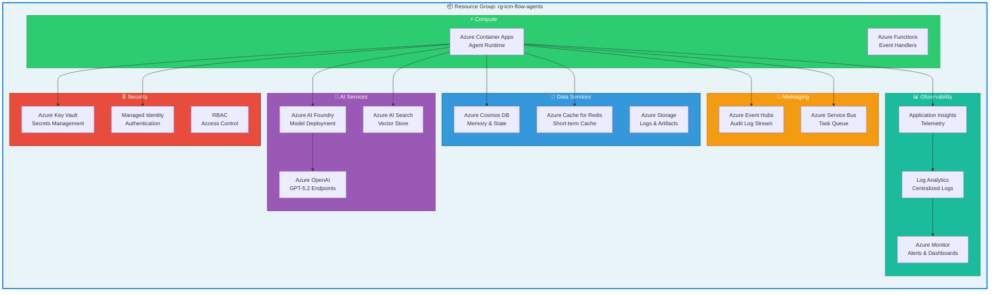
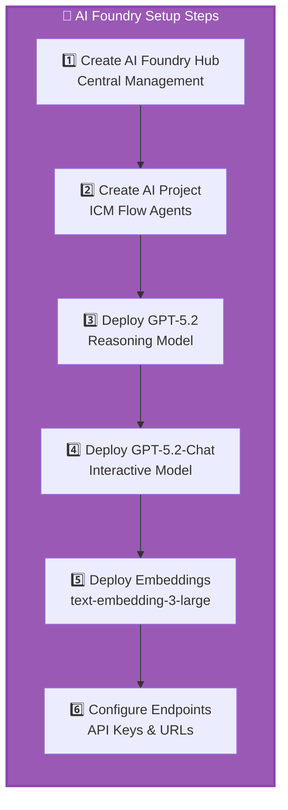
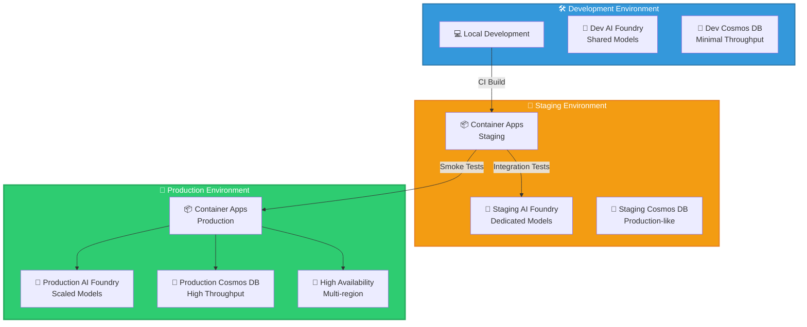
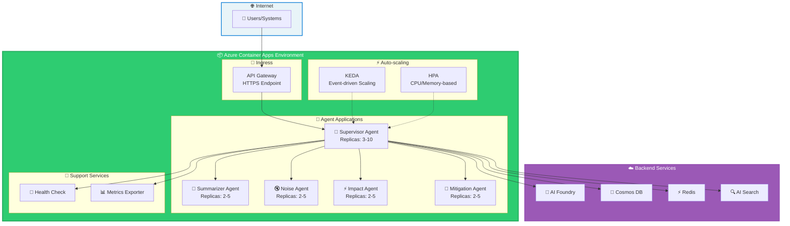
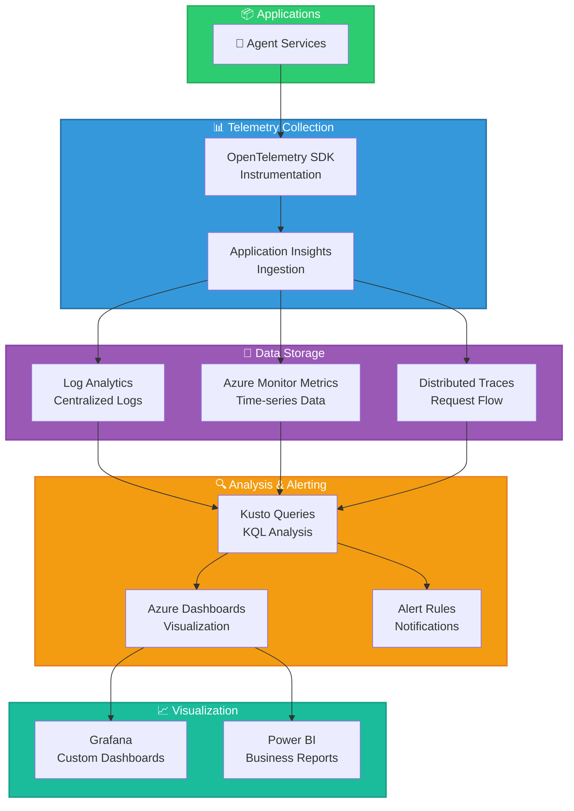
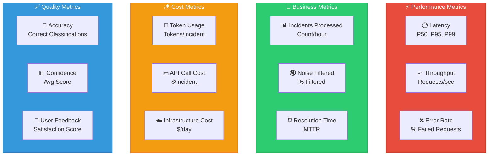
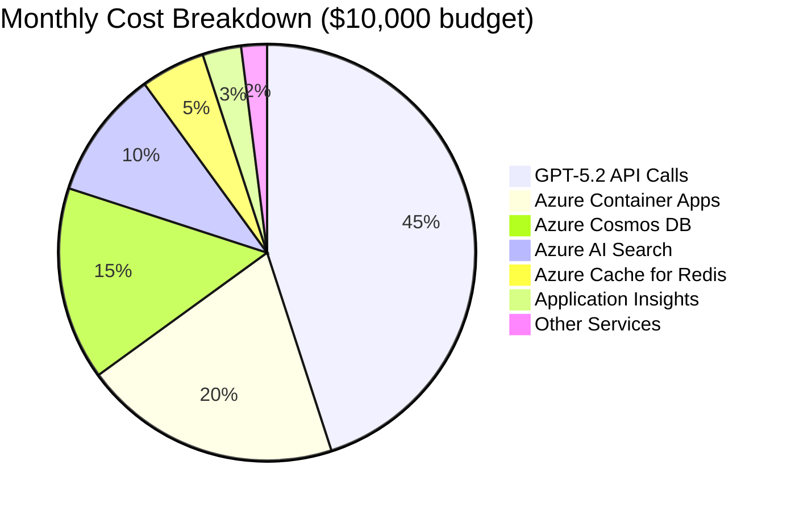
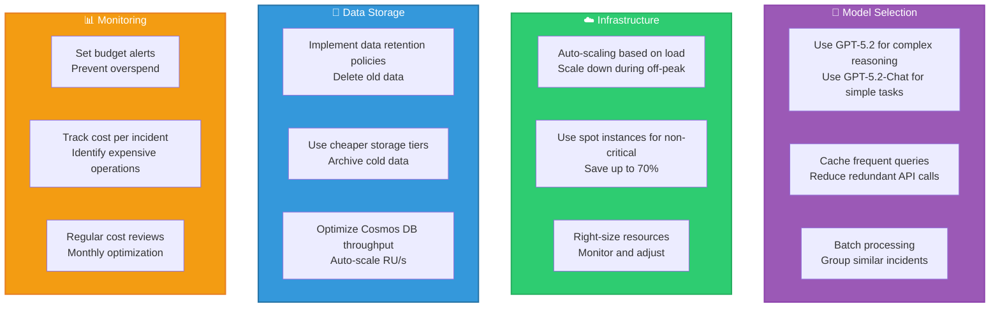

# Deployment Guide - Azure AI Foundry & Microsoft Agent Framework

## Table of Contents
1. [Infrastructure Overview](#infrastructure-overview)
2. [Azure Resource Setup](#azure-resource-setup)
3. [Deployment Architecture](#deployment-architecture)
4. [CI/CD Pipeline](#cicd-pipeline)
5. [Monitoring & Observability](#monitoring--observability)
6. [Cost Optimization](#cost-optimization)

---

## Infrastructure Overview

### Azure Resources Required



---

## Azure Resource Setup

### 1. Prerequisites

```bash
# Install Azure CLI
az --version

# Install Bicep CLI
az bicep install

# Login to Azure
az login

# Set subscription
az account set --subscription "Your-Subscription-ID"
```

### 2. Resource Group Creation

```bash
# Create resource group
az group create \
  --name rg-icm-flow-agents \
  --location westus2 \
  --tags Environment=Production Project=ICMFlowAgents
```

### 3. Azure AI Foundry Setup



#### Create AI Foundry Hub

```bash
# Create AI Foundry Hub
az ml workspace create \
  --name aihub-icm-flow \
  --resource-group rg-icm-flow-agents \
  --location westus2 \
  --kind hub

# Create AI Project
az ml workspace create \
  --name aiproject-icm-agents \
  --resource-group rg-icm-flow-agents \
  --location westus2 \
  --kind project \
  --hub-id /subscriptions/{subscription-id}/resourceGroups/rg-icm-flow-agents/providers/Microsoft.MachineLearningServices/workspaces/aihub-icm-flow
```

#### Deploy GPT-5.2 Models

```bash
# Deploy GPT-5.2 (Reasoning)
az ml online-deployment create \
  --name gpt-5-2-deployment \
  --model gpt-5.2 \
  --workspace-name aiproject-icm-agents \
  --resource-group rg-icm-flow-agents \
  --sku-name Standard_D4s_v3 \
  --instance-count 3

# Deploy GPT-5.2-Chat (Interactive)
az ml online-deployment create \
  --name gpt-5-2-chat-deployment \
  --model gpt-5.2-chat \
  --workspace-name aiproject-icm-agents \
  --resource-group rg-icm-flow-agents \
  --sku-name Standard_D4s_v3 \
  --instance-count 2

# Get endpoint URLs
az ml online-endpoint show \
  --name gpt-5-2-deployment \
  --workspace-name aiproject-icm-agents \
  --resource-group rg-icm-flow-agents \
  --query scoring_uri
```

### 4. Azure AI Search (Vector Store)

```bash
# Create AI Search service
az search service create \
  --name aisearch-icm-flow \
  --resource-group rg-icm-flow-agents \
  --location westus2 \
  --sku standard \
  --partition-count 1 \
  --replica-count 2

# Create vector index (via Python SDK or REST API)
```

### 5. Azure Cosmos DB (Memory Store)

```bash
# Create Cosmos DB account
az cosmosdb create \
  --name cosmos-icm-flow \
  --resource-group rg-icm-flow-agents \
  --locations regionName=westus2 failoverPriority=0 \
  --default-consistency-level Session \
  --enable-automatic-failover true

# Create database
az cosmosdb sql database create \
  --account-name cosmos-icm-flow \
  --resource-group rg-icm-flow-agents \
  --name icm-flow-agents

# Create containers
az cosmosdb sql container create \
  --account-name cosmos-icm-flow \
  --database-name icm-flow-agents \
  --name agent-memory \
  --partition-key-path "/incident_id" \
  --throughput 400

az cosmosdb sql container create \
  --account-name cosmos-icm-flow \
  --database-name icm-flow-agents \
  --name execution-history \
  --partition-key-path "/agent_id" \
  --throughput 400
```

### 6. Azure Cache for Redis

```bash
# Create Redis cache
az redis create \
  --name redis-icm-flow \
  --resource-group rg-icm-flow-agents \
  --location westus2 \
  --sku Premium \
  --vm-size P1 \
  --enable-non-ssl-port false
```

### 7. Azure Key Vault

```bash
# Create Key Vault
az keyvault create \
  --name kv-icm-flow \
  --resource-group rg-icm-flow-agents \
  --location westus2 \
  --enable-rbac-authorization true

# Store secrets
az keyvault secret set \
  --vault-name kv-icm-flow \
  --name "AzureOpenAI-ApiKey" \
  --value "your-api-key"

az keyvault secret set \
  --vault-name kv-icm-flow \
  --name "CosmosDB-ConnectionString" \
  --value "your-connection-string"
```

---

## Deployment Architecture

### Multi-Environment Strategy



### Container Apps Architecture



### Deployment Configuration

```yaml
# container-apps-config.yaml
apiVersion: apps/v1
kind: ContainerApp
metadata:
  name: supervisor-agent
spec:
  configuration:
    activeRevisionsMode: Multiple
    ingress:
      external: true
      targetPort: 8000
      transport: http
      traffic:
        - weight: 100
          latestRevision: true
    secrets:
      - name: azure-openai-key
        keyVaultUrl: https://kv-icm-flow.vault.azure.net/secrets/AzureOpenAI-ApiKey
      - name: cosmos-connection
        keyVaultUrl: https://kv-icm-flow.vault.azure.net/secrets/CosmosDB-ConnectionString
  template:
    containers:
      - name: supervisor-agent
        image: acricmflow.azurecr.io/supervisor-agent:latest
        resources:
          cpu: 2.0
          memory: 4Gi
        env:
          - name: AZURE_OPENAI_ENDPOINT
            value: https://aiproject-icm-agents.openai.azure.com/
          - name: AZURE_OPENAI_API_KEY
            secretRef: azure-openai-key
          - name: AZURE_COSMOS_CONNECTION_STRING
            secretRef: cosmos-connection
          - name: ENVIRONMENT
            value: production
    scale:
      minReplicas: 3
      maxReplicas: 10
      rules:
        - name: http-scaling
          http:
            metadata:
              concurrentRequests: 100
        - name: queue-scaling
          custom:
            type: azure-servicebus
            metadata:
              queueName: incident-queue
              messageCount: 50
```

---

## CI/CD Pipeline

### Pipeline Architecture

```mermaid
graph LR
    subgraph Source["📝 Source Control"]
        GitHub["GitHub Repository"]
    end
    
    subgraph CI["🔨 Continuous Integration"]
        Build["🏗️ Build<br/>Docker Images"]
        Test["🧪 Unit Tests<br/>Integration Tests"]
        Scan["🔍 Security Scan<br/>Vulnerability Check"]
        Push["📤 Push to ACR<br/>Azure Container Registry"]
    end
    
    subgraph CD["🚀 Continuous Deployment"]
        DeployStaging["📦 Deploy to Staging"]
        SmokeTest["💨 Smoke Tests"]
        ApprovalGate["✅ Manual Approval"]
        DeployProd["🚀 Deploy to Production"]
        HealthCheck["💚 Health Check"]
    end
    
    subgraph Monitoring["📊 Post-Deployment"]
        Monitor["📈 Monitor Metrics"]
        Alert["🚨 Alert on Issues"]
        Rollback["↩️ Auto-rollback"]
    end
    
    GitHub --> Build
    Build --> Test
    Test --> Scan
    Scan --> Push
    
    Push --> DeployStaging
    DeployStaging --> SmokeTest
    SmokeTest --> ApprovalGate
    ApprovalGate --> DeployProd
    DeployProd --> HealthCheck
    
    HealthCheck --> Monitor
    Monitor --> Alert
    Alert --> Rollback

    style Source fill:#333,stroke:#000,stroke-width:2px,color:#fff
    style CI fill:#3498DB,stroke:#2874A6,stroke-width:2px,color:#fff
    style CD fill:#2ECC71,stroke:#27AE60,stroke-width:2px,color:#fff
    style Monitoring fill:#F39C12,stroke:#E67E22,stroke-width:2px,color:#fff
```



### GitHub Actions Workflow

```yaml
# .github/workflows/deploy.yml
name: Deploy ICM Flow Agents

on:
  push:
    branches: [main]
  pull_request:
    branches: [main]

env:
  AZURE_CONTAINER_REGISTRY: acricmflow
  RESOURCE_GROUP: rg-icm-flow-agents

jobs:
  build-and-test:
    runs-on: ubuntu-latest
    steps:
      - uses: actions/checkout@v4
      
      - name: Set up Python 3.11
        uses: actions/setup-python@v5
        with:
          python-version: '3.11'
      
      - name: Install dependencies
        run: |
          pip install -r requirements.txt
          pip install pytest pytest-cov
      
      - name: Run tests
        run: |
          pytest tests/ --cov=src --cov-report=xml
      
      - name: Security scan
        uses: aquasecurity/trivy-action@master
        with:
          scan-type: 'fs'
          scan-ref: '.'
      
      - name: Build Docker images
        run: |
          docker build -t ${{ env.AZURE_CONTAINER_REGISTRY }}.azurecr.io/supervisor-agent:${{ github.sha }} -f docker/Dockerfile.supervisor .
          docker build -t ${{ env.AZURE_CONTAINER_REGISTRY }}.azurecr.io/summarizer-agent:${{ github.sha }} -f docker/Dockerfile.summarizer .
      
      - name: Login to ACR
        uses: azure/docker-login@v1
        with:
          login-server: ${{ env.AZURE_CONTAINER_REGISTRY }}.azurecr.io
          username: ${{ secrets.ACR_USERNAME }}
          password: ${{ secrets.ACR_PASSWORD }}
      
      - name: Push images to ACR
        run: |
          docker push ${{ env.AZURE_CONTAINER_REGISTRY }}.azurecr.io/supervisor-agent:${{ github.sha }}
          docker push ${{ env.AZURE_CONTAINER_REGISTRY }}.azurecr.io/summarizer-agent:${{ github.sha }}

  deploy-staging:
    needs: build-and-test
    runs-on: ubuntu-latest
    environment: staging
    steps:
      - name: Azure Login
        uses: azure/login@v1
        with:
          creds: ${{ secrets.AZURE_CREDENTIALS }}
      
      - name: Deploy to Container Apps (Staging)
        run: |
          az containerapp update \
            --name supervisor-agent-staging \
            --resource-group ${{ env.RESOURCE_GROUP }} \
            --image ${{ env.AZURE_CONTAINER_REGISTRY }}.azurecr.io/supervisor-agent:${{ github.sha }}
      
      - name: Run smoke tests
        run: |
          curl -f https://supervisor-agent-staging.azurecontainerapps.io/health || exit 1

  deploy-production:
    needs: deploy-staging
    runs-on: ubuntu-latest
    environment: production
    steps:
      - name: Azure Login
        uses: azure/login@v1
        with:
          creds: ${{ secrets.AZURE_CREDENTIALS }}
      
      - name: Deploy to Container Apps (Production)
        run: |
          az containerapp update \
            --name supervisor-agent \
            --resource-group ${{ env.RESOURCE_GROUP }} \
            --image ${{ env.AZURE_CONTAINER_REGISTRY }}.azurecr.io/supervisor-agent:${{ github.sha }} \
            --revision-suffix ${{ github.sha }}
      
      - name: Health check
        run: |
          sleep 30
          curl -f https://supervisor-agent.azurecontainerapps.io/health || exit 1
      
      - name: Monitor deployment
        run: |
          az containerapp revision list \
            --name supervisor-agent \
            --resource-group ${{ env.RESOURCE_GROUP }} \
            --query "[?properties.trafficWeight>0]"
```

---

## Monitoring & Observability

### Observability Stack



### Key Metrics to Monitor



### Alert Configuration

```yaml
# alert-rules.yaml
alerts:
  - name: High Error Rate
    severity: critical
    condition: |
      requests
      | where success == false
      | summarize error_rate = count() by bin(timestamp, 5m)
      | where error_rate > 100
    actions:
      - type: email
        recipients: [oncall@company.com]
      - type: pagerduty
        integration_key: ${PAGERDUTY_KEY}
  
  - name: High Latency
    severity: warning
    condition: |
      requests
      | summarize p95_latency = percentile(duration, 95) by bin(timestamp, 5m)
      | where p95_latency > 5000
    actions:
      - type: teams
        webhook: ${TEAMS_WEBHOOK}
  
  - name: Cost Threshold Exceeded
    severity: warning
    condition: |
      customMetrics
      | where name == "token_usage"
      | summarize daily_cost = sum(value) * 0.00006 by bin(timestamp, 1d)
      | where daily_cost > 1000
    actions:
      - type: email
        recipients: [finance@company.com]
```

---

## Cost Optimization

### Cost Breakdown



### Optimization Strategies



### Cost Monitoring Dashboard

```kusto
// Daily cost by service
AzureDiagnostics
| where TimeGenerated > ago(30d)
| summarize 
    GPT52_Cost = sum(iff(Resource contains "gpt-5-2", TokenCount * 0.00006, 0)),
    ContainerApps_Cost = sum(iff(Resource contains "containerapp", CPUUsage * 0.0001, 0)),
    CosmosDB_Cost = sum(iff(Resource contains "cosmos", RUConsumed * 0.00008, 0))
  by bin(TimeGenerated, 1d)
| render timechart
```

---

**Document Version**: 1.0  
**Last Updated**: February 10, 2026  
**Author**: ICM Flow Agents Team

<!-- Added instructions for dev container deployment and vscode integration -->
